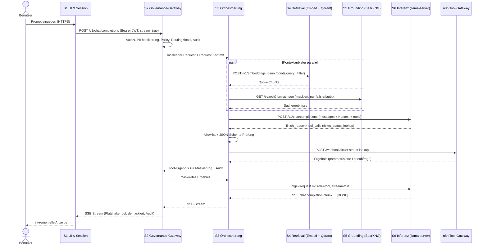
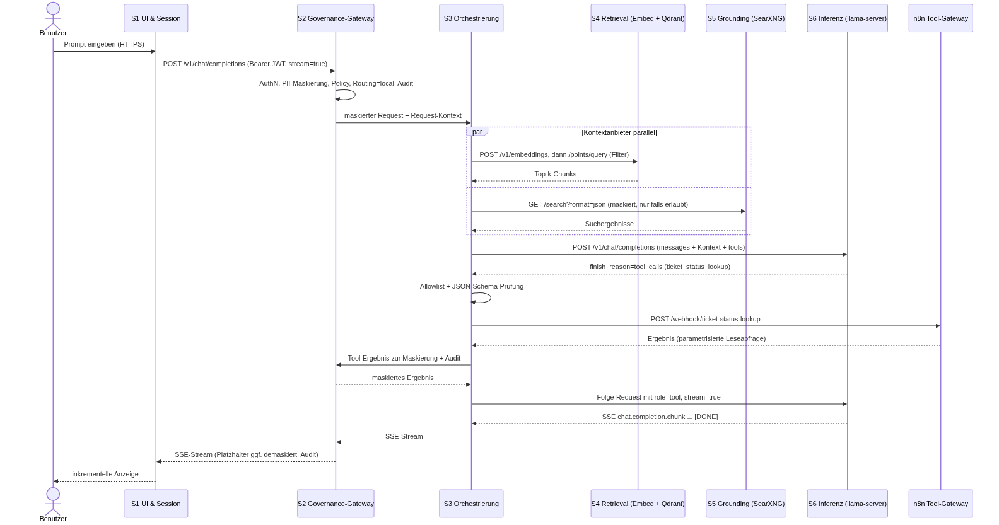

# AISM – AI Stack Reference Model

**Spezifikation eines Request-Pipeline-Modells für lokale und hybride KI-Stacks**

| | |
|---|---|
| Dokumentstatus | Entwurf (Draft) 0.2 |
| Datum | 05.10.2026 |
| Bezug | `README.md` (AISM Reference Stack, 7-Stufen-Architektur), `diagram.png`, `docker-compose.yml`, [`policy/AISM-Policy-Format.md`](policy/AISM-Policy-Format.md), [`conformance/AISM-Konformitaet.md`](conformance/AISM-Konformitaet.md) |
| Änderungen 0.2 | README/Compose an S1–S7 angeglichen; S3 als eigener Dienst; AISM-Endpunkte für S2; Kriterien M-15, S-10 bis S-13; KANN-Kriterien in O-01 bis O-03 umbenannt; offene Punkte bereinigt |
| Nachtrag 05.10.2026 | Open WebUI auf `v0.11.4` gepinnt (Variablen verifiziert); Referenz-Host-Firewall `deploy/firewall/`; Gateway-Prototyp `gateway/` und Orchestrator-Stub `orchestrator/`; Endpunkt `/internal/v1/audit`; Stream-Demaskierung spezifiziert; offene Punkte aktualisiert |
| Nachtrag 05.10.2026 (2) | Policy-Signatur (SSHSIG/Ed25519, §6.2.1), Revision und Anti-Rollback; Image-Digests; OIDC/JWKS im Gateway; Web-Suche über SearXNG und Bestätigungsablauf für schreibende Tools im Orchestrator (§6.3.1); Cloud-Fallback-Szenario; NER-Messung; Lauf im Docker-Konformitäts-Stack (K3 erreicht, Prototyp); offene Punkte aktualisiert |
| Nachtrag 05.10.2026 (3) | Projekt umbenannt: Spezifikation und Referenzimplementierung heißen einheitlich **AISM** (Referenzimplementierung: *AISM Reference Stack*); Header `X-AISM-*`, Umgebungsvariablen `AISM_*`, Policy-`apiVersion` `aism/v1alpha1`, Schema-`$id` `urn:aism:schema:policy:v1alpha1`. Keine inhaltlichen Änderungen an Kriterien. |
| Nachtrag 06.10.2026 | Personen-Gazetteer und Kontextregeln als Policy-Detektor (`type: gazetteer`); NER-Modelle `spacy:` und `gliner:` in der Policy wählbar. Standard bleibt `spacy:xx_ent_wiki_sm` plus Gazetteer. Messung auf einem frischen Held-out-Set: [`conformance/pii-eval/README.md`](conformance/pii-eval/README.md). CI führt Lint, Unit-Tests, Schema, Signatur, PII-Gate, reproduzierbaren Build und die Konformitätssuite (Mocks) aus. |
| Nachtrag 06.10.2026 (2) | Optionale NER-Kaskade (`ner.cascade`): das schnelle Modell läuft immer, ein schwereres Modell nur auf verdächtigen Sätzen, fail-closed wenn das Sekundärmodell konfiguriert aber nicht ladbar ist. Standard-Policy und Standard-Image bleiben ohne torch. Messung: [`conformance/pii-eval/README.md`](conformance/pii-eval/README.md) Abschnitt H. |
| Nachtrag 06.10.2026 (3) | Schlüsselrotation und Vier-Augen-Signaturen (§6.2.1): quorum-signierter Schlüsselring mit Gültigkeitsfenstern und Widerruf, Bündel `policy.yaml.sigs`, Schwelle (K3-Standard 2), Anti-Rollback des Rings. Tests AISM-K3-11, AISM-K3-12. Kein HSM, kein Transparenzlog. |
| Nachtrag 06.10.2026 (4) | Audit über die lokale Datei hinaus (§6.2.2): S3 Object Lock als eigene Senke, signierte Prüfpunkte (Rolle `audit`), begrenzte Warteschlange mit Fail-closed, Sicherung von `keyring-state.json`. Tests AISM-K3-13, AISM-K3-14, AISM-K3-15. Kein Cloud-Dienst erforderlich. |
| Sprache | Deutsch; Protokoll-, Feld- und Produktnamen im Original |

> **Hinweis:** „AISM“ bezeichnet das Referenzmodell; die Referenzimplementierung heißt „AISM Reference Stack“. AISM ist ein unabhängiges Projekt ohne Verbindung zu anderen Produkten ähnlichen Namens oder Zwecks. Die mit „AISM-Bezeichnung“ gekennzeichneten Kürzel (z. B. *SSGP*, *GVP*) sind **ausschließlich interne Modellbegriffe**. Es handelt sich **nicht** um Protokolle oder Standards. Auf der Leitung werden ausschließlich die jeweils genannten realen Standards verwendet.

---

## Inhaltsverzeichnis

1. [Zweck und Geltungsbereich](#1-zweck-und-geltungsbereich)
2. [Terminologie](#2-terminologie)
3. [Modellcharakter: Request-Pipeline statt OSI-Kapselung](#3-modellcharakter-request-pipeline-statt-osi-kapselung)
4. [Nummerierung und Zuordnung zur README](#4-nummerierung-und-zuordnung-zur-readme)
5. [Schichtenübersicht](#5-schichtenübersicht)
6. [Schichtspezifikationen](#6-schichtspezifikationen)
7. [End-to-End-Request-Fluss](#7-end-to-end-request-fluss)
8. [Governance-Policy-Punkte](#8-governance-policy-punkte)
9. [Konformitätskriterien](#9-konformitätskriterien)
10. [Offene Punkte](#10-offene-punkte)

---

## 1. Zweck und Geltungsbereich

### 1.1 Zweck

AISM beschreibt einen lokalen bzw. hybriden KI-Stack als **Request-Pipeline** mit definierten Schnittstellen zwischen den Stufen. Das Modell soll

- Administratoren und Betreibern eine gemeinsame Sprache für Betrieb, Fehlersuche und Audit geben,
- für jede Stufe festlegen, **welche realen Protokolle und Datenformate** verwendet werden,
- die **Policy-Durchsetzungspunkte** (PII-Maskierung, Allowlists, Audit, Cloud-Fallback-Entscheidung) eindeutig verorten,
- prüfbare **Konformitätskriterien** für Implementierungen und Komponententausch (z. B. vLLM statt llama.cpp, Milvus statt Qdrant) definieren.

### 1.2 Geltungsbereich

Im Geltungsbereich liegen alle Komponenten der Referenzarchitektur aus `README.md`: Chat-UI, Governance-Proxy und Router, Orchestrierung und Agenten (n8n), Retrieval (Embedding-Server, Qdrant), Grounding (SearXNG, Perplexica), Inferenz (llama.cpp bzw. Alternativen), Compute (Docker, NVIDIA Container Toolkit, CUDA, ROCm) sowie Telemetrie und Dashboard als **querschnittliche Beobachtungsfunktion**.

Nicht im Geltungsbereich:

- interne Implementierungsdetails einzelner Produkte (z. B. Indexstrukturen in Qdrant),
- Modellqualität, Modellauswahl im Detail und Leistungskennzahlen. Diese Spezifikation enthält **keine** Latenz- oder Durchsatzwerte; solche Werte sind deployment-spezifisch zu messen.
- Rechtliche Bewertung (DSGVO o. Ä.). AISM liefert technische Kontrollpunkte, aber keine Rechtsauslegung.

### 1.3 Normative Sprache

Die Schlüsselwörter **MUSS**, **DARF NICHT**, **SOLLTE**, **SOLLTE NICHT** und **KANN** sind im Sinne von RFC 2119 (MUST, MUST NOT, SHOULD, SHOULD NOT, MAY) zu verstehen.

---

## 2. Terminologie

| Begriff | Bedeutung in diesem Dokument |
|---|---|
| **Stufe (S1–S7)** | Funktionale Einheit der AISM-Pipeline. Eine Stufe kann durch mehrere Container realisiert werden und umgekehrt. |
| **Komponentengruppe (L1–L7)** | Bottom-up-Nummerierung der Komponentengruppen aus README v0.1. Die README verwendet seit v0.2 die S-Nummerierung und führt L1–L7 nur noch als Referenzspalte. |
| **AISM-Bezeichnung** | Internes Kürzel einer Stufe zur Referenzierung in Betriebsdokumentation. **Kein Protokoll, kein Standard.** |
| **Request-Kontext** | Die Gesamtheit aus (maskiertem) Prompt, Identität, Policy-Entscheidung, Routing-Ziel und angereichertem Kontext, die eine Anfrage durch die Pipeline begleitet. |
| **Anreicherung (Enrichment)** | Hinzufügen von Kontext (RAG-Treffer, Web-Suchergebnisse) zu einer Anfrage, ohne die Anfrage in ein neues Protokoll zu kapseln. |
| **Routing** | Auswahl des Inferenz-Ziels (lokal oder Cloud) durch Policy. |
| **PEP** | *Policy Enforcement Point*, also eine Stelle, an der Policy technisch durchgesetzt wird. |
| **PDP** | *Policy Decision Point*, die Stelle, die über eine Anfrage entscheidet (hier: Policy-Engine im Governance-Gateway). |
| **PII** | Personenbezogene oder sensible Daten. Im Referenzumfang: Personennamen, E-Mail-Adressen, API-Keys/Secrets/Tokens. |
| **Platzhalter** | Reversibler Ersatz für PII, z. B. `<PERSON_1>`, `<EMAIL_1>`, `<SECRET_1>`. |
| **Tool-Call** | Strukturierter Funktionsaufruf, den ein Modell vorschlägt (`tool_calls` im OpenAI-Chat-Completions-Schema). |
| **Egress** | Jeder Datenfluss, der das lokale Deployment verlässt (Cloud-API, Web-Suche, externe Tool-Ziele). |
| **SSE** | Server-Sent Events, Medientyp `text/event-stream` (WHATWG HTML Living Standard). |
| **CDI** | Container Device Interface, eine Spezifikation zur Beschreibung von Gerätezugriff für Container-Runtimes. |

---

## 3. Modellcharakter: Request-Pipeline statt OSI-Kapselung

### 3.1 Was AISM ist

AISM ist ein **Request-Pipeline-Modell**. Eine Anfrage durchläuft definierte Stufen; jede Stufe hat eine festgelegte Eingangs- und Ausgangsschnittstelle. Zwischen den Stufen finden zwei Arten von Operationen statt:

- **Anreicherung**: Kontext wird hinzugefügt (z. B. RAG-Chunks als zusätzliche Nachricht im `messages`-Array).
- **Routing/Weiterleitung**: Die Anfrage wird an das nächste Ziel weitergeleitet, ggf. nach einer Policy-Entscheidung.

Fast alle Stufen sprechen **dasselbe Anwendungsprotokoll** (HTTP mit JSON, OpenAI-kompatibles Schema). Daten werden dabei **transformiert** (maskiert, ergänzt, gefiltert), aber **nicht gekapselt**.

### 3.2 Die OSI-Analogie und ihre Grenzen

Die Analogie zum OSI-Modell ist nur didaktisch nützlich: Wie bei OSI hat jede Stufe eine klar abgegrenzte Verantwortung und definierte Schnittstellen zu ihren Nachbarn.

Die Analogie trägt **nicht** in folgenden Punkten:

| OSI-Eigenschaft | Situation in AISM |
|---|---|
| Jede Schicht kapselt die PDU der darüberliegenden Schicht (Header + Payload). | Keine Kapselung. Ein Chat-Completions-Request bleibt von S1 bis S6 ein JSON-Objekt desselben Schemas; er wird nur verändert. |
| Strikte Nachbarschaft: Schicht N spricht nur mit N±1. | S3 ruft S4 und S5 **parallel** auf; Telemetrie beobachtet **alle** Stufen; S2 kontrolliert auch den Egress späterer Stufen. |
| Alle Schichten liegen im Kommunikationspfad. | S7 (Compute) ist **keine Netzwerkschicht**. Sie stellt Rechenressourcen per Gerätezuordnung bereit; es gibt dort keine PDU auf der Leitung. |
| Peer-to-Peer-Protokoll je Schicht. | Es gibt keine „AISM-Protokolle“. Die AISM-Bezeichnungen sind Namen für Stufen, nicht für Wire-Formate. |
| Transportschichten unterhalb der Anwendung. | Alle Netzwerkschnittstellen in AISM liegen in OSI-Schicht 7 (HTTP, gRPC). TCP/IP und TLS werden vorausgesetzt und nicht modelliert. |

---

## 4. Nummerierung und Zuordnung zur README

### 4.1 Entscheidung

AISM nummeriert **top-down in Request-Richtung**: S1 ist die dem Benutzer nächste Stufe, S7 die hardwarenächste. Begründung:

- Die Nummer entspricht der Reihenfolge, in der eine Anfrage die Stufen erreicht. Das erleichtert Fehlersuche entlang des Pfades („Fehler ab S3“).
- Das Governance-Gateway erhält eine niedrige Nummer (S2) und macht so sichtbar, dass es **vor** jedem Modell- oder Netzwerkzugriff liegt.
- S4 (Retrieval) und S5 (Grounding) sind **parallele Kontextanbieter** von S3. Ihre Nummern drücken keine Reihenfolge untereinander aus.

Der Benutzer selbst ist **keine Stufe**, sondern der Ursprung der Anfrage (in Diagrammen „S0/Benutzer“).

### 4.2 Abgrenzung zur früheren README-Nummerierung

Ein früher README-Entwurf nummerierte die Komponenten **bottom-up nach Komponentengruppen** (L1 Compute … L7 Governance). Die README verwendet inzwischen ebenfalls die AISM-Stufen S1–S7. Die L-Nummern bleiben dort als Spalte „Component group (earlier numbering)“ erhalten. Zur Vermeidung von Verwechslungen gilt:

- AISM-Stufen werden **immer** mit Präfix `S` geschrieben (S1–S7).
- Komponentengruppen der alten Nummerierung werden **immer** mit Präfix `L` geschrieben (L1–L7).
- Konformitätsstufen heißen **K1–K3** (siehe `conformance/AISM-Konformitaet.md`).

Die im ursprünglichen Entwurf verwendete Reihenfolge „7, 3, 6, 4, 5, 2, 1“ entspricht den L-Nummern in Request-Reihenfolge. AISM ersetzt diese Mischnummerierung durch die durchgehende Nummerierung S1–S7.

### 4.3 Zuordnungstabelle

| AISM-Stufe | Name | Komponentengruppe (L, früherer README-Entwurf) | Referenzkomponenten (`docker-compose.yml`) |
|---|---|---|---|
| — (S0) | Benutzer | — | Browser, API-Client |
| **S1** | UI & Session | **L3** Interface & Chat | Open WebUI (Alternativen: LibreChat, NextChat) |
| **S2** | Governance-Gateway | **L7** Privacy & Governance | `governance-proxy` inkl. Routing-Entscheidung, Egress-Kontrolle, Audit-Log; Policy `policy/policy.yaml` |
| **S3** | Orchestrierung & Agenten | **L6** Workflows & Agents | `orchestrator` (eigener Dienst); `n8n` als Tool-Gateway (Alternativen: Flowise, LangGraph) |
| **S4** | Retrieval (RAG) | **L4** Retrieval & Memory | Embedding-Server (`llama-server --embedding` / TEI), Qdrant (Alternativen: Milvus, Chroma; Unstructured) |
| **S5** | Grounding (Web-Suche) | **L5** Search & Grounding | Perplexica, SearXNG |
| **S6** | Inferenz | **L2** Inference | llama.cpp `llama-server` (Alternativen: vLLM, Ollama); Cloud-API als policy-gesteuertes Fallback-Ziel |
| **S7** | Compute | **L1** Compute & Hardware | Docker, NVIDIA Container Toolkit, CUDA, ROCm |
| quer | Telemetrie & Dashboard | (README §4.4, §8) | Docker-Engine-API, DCGM-Exporter/NVML, `rocm-smi`, Dashboard |

---

## 5. Schichtenübersicht

| Nr. | Name | AISM-Bezeichnung (intern) | Reale Standards | PDU / Datenformat | Schnittstelle / Port (Referenz) | Verantwortung |
|---|---|---|---|---|---|---|
| S1 | UI & Session | SSGP *(Session-/Gateway-Stufe der UI; kein Protokoll)* | HTTPS (TLS), WebSocket (RFC 6455), OpenID Connect, JWT (RFC 7519) | HTTP-Request/Response (JSON), WebSocket-Frames | Open WebUI: Container `8080`, Host `3000` | Benutzerinteraktion, Authentifizierung, Sitzung, Darstellung des Streams |
| S2 | Governance-Gateway | GVP *(Governance-Stufe; kein Protokoll)* | HTTP-Reverse-Proxy mit eigener TLS-Terminierung, OpenAI-kompatibles API-Passthrough (`/v1/*`) | Chat-Completions-Request/-Response (JSON), SSE-Chunks | `governance-proxy:8000` (`/v1/*`, `/health`, `/aism/v1/policy`); intern `:8001` (`/internal/*`, nur S3) | AuthZ, PII-Maskierung, Policy, Routing-Entscheidung, Egress-Kontrolle, Audit |
| S3 | Orchestrierung & Agenten | JATP *(Agent-/Tool-Stufe; kein Protokoll)* | OpenAI Function-/Tool-Calling-Schema, JSON-RPC 2.0, Model Context Protocol (MCP), n8n-Webhooks (HTTP) | `messages`-Array, `tool_calls`, JSON-RPC-Request/-Response | n8n `5678` (`/webhook/<pfad>`); MCP via stdio oder HTTP | Kontext-Anreicherung, Aufruf von S4/S5, Tool-Call-Ausführung über validierendes Gateway |
| S4 | Retrieval (RAG) | MSIP *(Memory-/Such-Index-Stufe; kein Protokoll)* | Qdrant REST API, Qdrant gRPC (Protocol Buffers), OpenAI-kompatibles `/v1/embeddings` | Embedding-Request/-Response (JSON), Vektor-Query, Punkte mit Payload | Qdrant `6333` (REST), `6334` (gRPC); `llama-embed:8080/v1/embeddings` | Chunking, Embedding (separater Endpunkt), Vektorsuche, Rückgabe von Kontext-Chunks |
| S5 | Grounding | WSP *(Web-Such-Stufe; kein Protokoll)* | SearXNG Search API (`format=json`), Perplexica HTTP-API | JSON-Suchergebnisse | SearXNG `8080` (intern); optional Perplexica `3000` (Host `3001`, Compose-Profil `perplexica`) | Web-Suche mit maskierter Anfrage, Quellenliste als Kontext |
| S6 | Inferenz | OICSP *(Inferenz-Stufe; kein Protokoll)* | HTTP/1.1 oder HTTP/2, SSE (`text/event-stream`), OpenAI Chat Completions Schema | `chat.completion` bzw. `chat.completion.chunk` (JSON in SSE `data:`-Zeilen) | `llama-server:8080/v1/chat/completions`; Cloud-Ziel nur über S2 | Token-Generierung, Streaming, Tool-Call-Vorschläge |
| S7 | Compute | HAP *(Hardware-Zugriffs-Stufe; kein Protokoll)* | CUDA, ROCm, NVIDIA Container Toolkit, CDI (Container Device Interface), Docker Compose `deploy.resources.reservations.devices` | **Keine Netzwerk-PDU.** Gerätezuordnung (Device Nodes, CDI-Spezifikation), GPU-Speicher | Device-Mapping (`nvidia.com/gpu=…`, `/dev/kfd`, `/dev/dri`) | Bereitstellung von GPU/CPU/RAM für Container; Isolation; Treiber steuert PCIe/Hardware |
| quer | Telemetrie | — | Docker Engine API, Prometheus-Exposition-Format, NVML/DCGM, `rocm-smi` | Metriken (Prometheus-Text), Container-Status (JSON) | `/var/run/docker.sock`, DCGM-Exporter (typisch `9400`), `llama-server --metrics` (`/metrics`) | Beobachtung aller Stufen, keine Teilnahme am Request-Pfad |

> Ports entsprechen der Referenz-`docker-compose.yml` aus der README bzw. den Upstream-Defaults und sind deployment-spezifisch änderbar.

---

## 6. Schichtspezifikationen

Für jede Stufe werden Eingänge, Ausgänge, Schnittstellenvertrag, Beispiel-Payloads, Fehlerverhalten und Sicherheitsanforderungen festgelegt. Fehlerantworten auf HTTP-Ebene verwenden für alle OpenAI-kompatiblen Endpunkte das Format:

```json
{
  "error": {
    "message": "Menschlich lesbare Beschreibung",
    "type": "policy_violation",
    "code": "pii_egress_denied"
  }
}
```

Die Werte für `type` und `code` in diesem Dokument sind **Beispiele der Referenzimplementierung (AISM Reference Stack)**, keine standardisierten Codes.

### 6.1 S1 – UI & Session

*AISM-Bezeichnung: SSGP (intern)*

**Eingänge**
- Benutzereingaben über Browser (HTTPS, WebSocket für Live-Updates).
- Identitätsnachweis über OIDC-Login beim Identity Provider (Authorization Code Flow) → ID-Token/Access-Token (JWT).

**Ausgänge**
- `POST /v1/chat/completions` an S2 mit `Authorization: Bearer <token>` und `"stream": true`.

**Schnittstellenvertrag**
- S1 MUSS jede Modellanfrage an S2 richten, nie direkt an S6.
- S1 MUSS eine dem Benutzer zuordenbare Identität mitsenden (JWT oder vom Gateway ausgestelltes Session-Token). In der Referenz sendet Open WebUI einen Client-Schlüssel als Bearer-Token und die Benutzeridentität als signiertes HS256-JWT im Header `X-OpenWebUI-User-Jwt` (`ENABLE_FORWARD_USER_INFO_HEADERS=true`, `FORWARD_USER_INFO_HEADER_JWT_SECRET`; vorhanden ab Open WebUI `v0.9.6`, Referenz-Pin `v0.11.4`). Ist das Secret gesetzt, ersetzt das JWT die Klartext-Header `X-OpenWebUI-User-*`. Es enthält laut Quellcode (`utils/headers.py`, Tag `v0.11.4`) die Claims `sub`, `email`, `name`, `role`, `iss` (`open-webui`), `iat`, `exp`, aber **keine Gruppen**; gruppenbasierte Rollen erfordern daher eine weitere Identitätsquelle (z. B. OIDC). `email` und `name` sind personenbezogen und DÜRFEN NICHT ins Audit-Log gelangen.
- S1 MUSS SSE-Streams inkrementell darstellen und den Abschluss über `data: [DONE]` erkennen.

**Beispiel-Payload (S1 → S2)**

```json
{
  "model": "aism-default",
  "stream": true,
  "messages": [
    {"role": "system", "content": "Du bist ein Assistent für den IT-Betrieb."},
    {"role": "user", "content": "Wie ist der Status von Ticket INC-2026-0042? Rückfragen bitte an anna.schmidt@example.com."}
  ]
}
```

**Fehlerverhalten**
- `401` von S2: Sitzung erneuern (OIDC-Re-Authentifizierung).
- `403` von S2: Policy-Ablehnung dem Benutzer verständlich anzeigen, ohne interne Policy-Details offenzulegen.
- Abbruch des SSE-Streams ohne `[DONE]`: Antwort als unvollständig kennzeichnen.

**Sicherheitsanforderungen**
- TLS für alle Verbindungen vom Client; HSTS SOLLTE gesetzt sein.
- Tokens DÜRFEN NICHT in URLs oder Logs erscheinen.
- S1 MUSS als einziges Modell-Backend das Gateway verwenden (Referenz: `OPENAI_API_BASE_URL=http://governance-proxy:8000/v1`, `ENABLE_OLLAMA_API=false`, `ENABLE_DIRECT_CONNECTIONS=false`).
- Eingebaute RAG- und Web-Such-Funktionen von S1 MÜSSEN deaktiviert sein, damit Retrieval und Suche ausschließlich in S3 nach der Maskierung stattfinden. Referenz für Open WebUI: `ENABLE_WEB_SEARCH=false`, `USER_PERMISSIONS_FEATURES_WEB_SEARCH=false`, `USER_PERMISSIONS_CHAT_FILE_UPLOAD=false`, `BYPASS_EMBEDDING_AND_RETRIEVAL=true`, `ENABLE_RETRIEVAL_QUERY_GENERATION=false`, `ENABLE_SEARCH_QUERY_GENERATION=false` sowie `ENABLE_PERSISTENT_CONFIG=false`, damit diese Werte nicht durch in der Datenbank gespeicherte Einstellungen überschrieben werden. Alle genannten Variablen sind in `backend/open_webui/config.py` bzw. `env.py` am Tag `v0.11.4` vorhanden (geprüft am 05.10.2026).
- Das `frontend`-Netz SOLLTE keinen Internet-Egress haben (Referenz: [`deploy/firewall/`](deploy/firewall/), `OFFLINE_MODE=true` für Open WebUI).

### 6.2 S2 – Governance-Gateway

*AISM-Bezeichnung: GVP (intern)*

Das Gateway ist ein **HTTP-Reverse-Proxy**, der **seine eigene TLS-Verbindung terminiert** (eigenes Zertifikat für seinen Hostnamen). Es führt **keine TLS-Interception** fremder Verbindungen durch (kein MITM, keine eingeschleuste CA). Es stellt eine OpenAI-kompatible API bereit und reicht Anfragen nach Prüfung im selben Schema weiter (Passthrough mit Transformation).

**Eingänge**
- Chat-Completions-Requests von S1 (und von anderen berechtigten Clients, z. B. Perplexica, n8n).
- Tool-Ergebnisse und Egress-Anfragen aus S3 (für Maskierung und Audit).
- Policy-Konfiguration (`policy.yaml`).

**Ausgänge**
- Maskierter Request plus Routing-Entscheidung an S3.
- Egress-Requests an Cloud-APIs (nur bei Policy-Freigabe).
- Audit-Einträge (JSONL).
- Gestreamte, ggf. demaskierte Antwort an S1.

**Verarbeitungsreihenfolge (normativ)**
1. Authentifizierung (JWT-Validierung: Signatur, `iss`, `aud`, `exp`). Bei `oidc-bearer` gegen die JWKS des IdP (asymmetrische Algorithmen, keine `HS*`); ist die JWKS nicht abrufbar, antwortet S2 mit `503` (fail-closed). Rollen werden aus dem Gruppen-Claim abgeleitet.
2. Größen- und Schemaprüfung des Requests.
3. PII-Erkennung und -Maskierung in **allen** `messages[].content`.
4. Policy-Auswertung (PDP): erlaubte Modelle, Collections, Tools, Egress-Klassen.
5. Routing-Entscheidung: `local` (Standard) oder `cloud` (nur bei expliziter Freigabe).
6. Audit-Eintrag schreiben.
7. Weitergabe an S3 mit Request-Kontext.

**Schnittstellenvertrag**
- Eingang und Ausgang sind OpenAI-kompatibel (`/v1/chat/completions`, `/v1/models`).
- Zusätzliche **AISM-eigene** Endpunkte (keine Standards), siehe Tabelle unten. Port 8001 ist nur im `backend`-Netz zu verwenden und MUSS ein internes Token (`INTERNAL_TOKEN`) verlangen.
- Die Policy wird gemäß [`policy/AISM-Policy-Format.md`](policy/AISM-Policy-Format.md) aus `/etc/aism/policy/policy.yaml` geladen (Verzeichnis-Mount, read-only, mit Signaturdatei `policy.yaml.sig` oder Bündel `policy.yaml.sigs`), siehe §6.2.1.
- Request-Kontext wird intern über Header weitergereicht, z. B. `X-AISM-Request-ID`, `X-AISM-Route: local`, `X-AISM-Policy-Decision: <id>`. Diese Header sind AISM-intern und MÜSSEN an der Egress-Grenze entfernt werden. Der W3C-Trace-Context-Header `traceparent` wird übernommen bzw. erzeugt und weitergereicht (S-10).

**AISM-eigene Endpunkte von S2**

| Endpunkt | Port | Zweck |
|---|---|---|
| `GET /health` | 8000 | Liveness/Readiness; `200` nur mit gültig geladener Policy |
| `GET /aism/v1/policy` | 8000 | Metadaten der aktiven Policy: `name`, `version`, `revision`, `digest`, `effective_from`, Signaturstatus (`signature.verified`, `signature.signers`, Schwelle), bei Schlüsselring dessen Version, letzter Ladefehler (keine Regelinhalte) |
| `GET /aism/v1/confirmations` | 8000 | Offene Bestätigungen des angemeldeten Benutzers (§6.3.1) |
| `POST /aism/v1/confirmations/{id}/approve` bzw. `/reject` | 8000 | Schreibende Tool-Aktion freigeben oder verwerfen; nur derselbe Benutzer |
| `POST /internal/v1/mask` | 8001 | Maskierung von Tool-Ergebnissen und RAG-Chunks für S3 mit der Platzhaltertabelle des Requests (PEP-8) |
| `POST /internal/v1/audit` | 8001 | Audit-Ereignisse von S3 (`tool.*`, `rag.query`, `egress.websearch`) in dieselbe Hash-Kette |
| `POST /internal/egress/v1/chat/completions` | 8001 | Policy-geprüfter Cloud-Egress für S3 (PEP-9) |

**Beispiel-Payload (S2 → S3, maskiert)**

```json
{
  "model": "qwen2.5-7b-instruct-q4_k_m",
  "stream": true,
  "messages": [
    {"role": "system", "content": "Du bist ein Assistent für den IT-Betrieb."},
    {"role": "user", "content": "Wie ist der Status von Ticket INC-2026-0042? Rückfragen bitte an <EMAIL_1>."}
  ]
}
```

**Beispiel-Audit-Eintrag**

```json
{
  "ts": "2026-10-05T10:15:02+02:00",
  "request_id": "req_7f3c",
  "subject": "user:4711",
  "event": "request.accepted",
  "pii_masked": {"EMAIL": 1, "PERSON": 0, "SECRET": 0},
  "route": "local",
  "policy_rule": "default-local-only",
  "tools_permitted": ["ticket_status_lookup"]
}
```

Der Audit-Eintrag enthält **Zähler und Kategorien**, nicht die Klartextwerte.

**Fehlerverhalten**

| Situation | HTTP-Status | Beispiel `code` |
|---|---|---|
| Token fehlt/ungültig | 401 | `invalid_token` |
| Policy verbietet Modell/Tool/Collection | 403 | `policy_denied` |
| Cloud-Routing angefordert, aber nicht freigegeben | 403 | `egress_denied` |
| Request zu groß | 413 | `request_too_large` |
| Schema ungültig | 400 | `invalid_request` |
| Rate-Limit | 429 | `rate_limited` |
| Upstream nicht erreichbar | 502 / 503 | `upstream_unavailable` |
| Upstream-Timeout | 504 | `upstream_timeout` |

**Demaskierung im Stream (Referenzverhalten):** Pro Choice hält S2 den Text ab dem letzten `<` zurück, solange dieser Rest ein möglicher Platzhalter-Anfang ist (Muster `<[A-Z_]*[0-9]*` ohne `>`) und höchstens 48 Zeichen lang ist; der Rest wird mit dem nächsten Chunk zusammengesetzt und spätestens beim `finish_reason` bzw. vor `data: [DONE]` ausgegeben. Unbekannte Platzhalter bleiben unverändert. Demaskiert wird nur für Rollen in `demaskFor`; `SECRET` nie.

**Referenzimplementierung:** [`gateway/`](gateway/) (Prototyp, nicht produktionsreif; Einschränkungen in `gateway/README.md`).

Fällt die PII-Erkennung aus, MUSS das Gateway **fail-closed** reagieren: keine Weiterleitung an Egress-Ziele. Lokale Verarbeitung KANN per Policy weiter erlaubt sein.

#### 6.2.1 Policy-Signatur und Aktivierung

- Die Policy SOLLTE signiert sein (S-11). Referenzverfahren: **SSHSIG mit Ed25519**. Begründung: offline nutzbar, keine Infrastruktur (kein Rekor/Fulcio), mit `ssh-keygen -Y verify -n aism-policy` je Signatur unabhängig prüfbar. Sigstore `cosign sign-blob` bleibt eine gleichwertige Alternative (`method: sigstore`) und ist im Prototyp nicht umgesetzt.
- Signiert werden die exakten Bytes der Policy-Datei. `metadata.revision` (Git-Commit oder Inhalts-SHA-256) MUSS gesetzt sein und ist mitsigniert. `metadata.signature` verweist auf `policy.yaml.sig` (eine Signatur, `signer`) oder `policy.yaml.sigs` (Bündel, `threshold`). Das Bündel nennt zusätzlich Revision und SHA-256-Digest; jede Signatur ist an diese Bytes gebunden.
- Vertrauensanker, nicht Teil der Policy: für Schwelle 1 eine `allowed_signers`-Datei; für mehrere Signierer ein Schlüsselring (`keyring.yaml`, Namespace `aism-keyring`). Der Ring nennt Identität, öffentlichen Schlüssel, Rollen (`policy`, `keyring`, `audit`), `notBefore`/`notAfter` und Widerruf. `policyThreshold` ist die Mindestzahl verschiedener gültiger Identitäten (K3-Standard **2**; K1/K2 dürfen 1 setzen). Eine Policy darf diese Schwelle nicht senken. Dieselbe Identität zählt einmal. Abgelaufene, widerrufene und unbekannte Schlüssel zählen nicht. Die Rolle `audit` signiert nur Audit-Prüfpunkte (§6.2.2) und zählt weder zum Policy- noch zum Schlüsselring-Quorum.
- Den Ring ändert nur ein Quorum (`keyringThreshold`) von Schlüsseln, die im **bisherigen** Ring gültig sind. Ein Schlüssel kann sich nicht allein eintragen und andere nicht allein entfernen. Die Version steigt streng monoton; `prev` bindet den Digest des Vorgängers. Eine ältere oder abweichende Fassung wird abgelehnt (Anti-Rollback). Rotation überlappt: der neue Schlüssel wird gültig, bevor der alte endet oder widerrufen wird. Das Gateway speichert den akzeptierten Ring (`POLICY_KEYRING_STATE`, sonst neben dem Audit-Log) und prüft ihn beim Start und beim Neuladen.
- Ist eine Signatur gefordert (`POLICY_REQUIRE_SIGNATURE`, Standard sobald `POLICY_ALLOWED_SIGNERS` oder ein `keyring.yaml` gesetzt ist), MUSS S2 eine Policy ohne ausreichende gültige Signaturen **ablehnen**. Die zuvor aktive Policy bleibt aktiv (`policy.load_failed`, `kept_active: true`), es sei denn, der neue Ring widerruft ihre Signierer; dann verwirft S2 sie (fail-closed). Beim Start ohne gültige Policy leitet S2 nichts weiter (M-15).
- Anti-Rollback der Policy: eine signierte Policy mit älterem `metadata.effectiveFrom` als die aktive wird abgelehnt.
- `GET /aism/v1/policy` MUSS Revision, Digest und die Identitäten der gezählten Signierer liefern, bei einem Schlüsselring auch dessen Version. Dieselben Identitäten (keine privaten Schlüssel) stehen in `policy.loaded` in der Audit-Hash-Kette.
- Werkzeug: [`tools/aism-policy-sign.py`](tools/aism-policy-sign.py) (`keygen`, `init-keyring`, `add-key`, `rotate-key`, `revoke-key`, `sign`, `verify`, `status`). Private Schlüssel gehören nicht in das Repository; die Konformitätssuite erzeugt ihre Testschlüssel zur Laufzeit. Format: [`policy/AISM-Policy-Format.md`](policy/AISM-Policy-Format.md) §6.1–§6.2.

**Sicherheitsanforderungen**
- Keine TLS-Interception; ausgehende TLS-Verbindungen zu Cloud-APIs MÜSSEN Zertifikate regulär validieren.
- Platzhalter-Zuordnungstabellen (Platzhalter ↔ Klartext) MÜSSEN request-gebunden, nur im Speicher und mit begrenzter Lebensdauer gehalten werden.
- Audit-Log SOLLTE append-only und manipulationserkennbar gespeichert werden. Die Referenz verkettet die lokale Datei und spiegelt sie in eine Object-Lock-Senke (§6.2.2).
- Secrets für Cloud-APIs liegen ausschließlich im Gateway, nicht in S1 oder S3.

#### 6.2.2 Audit-Kette, Prüfpunkte und unveränderliche Senke

Die lokale JSONL-Datei bleibt die geordnete Kette. Jede Zeile trägt `seq` (ab 1) und `prev_hash` = `sha256:` + SHA-256 der vorherigen Rohzeile (UTF-8, ohne Zeilenumbruch). Die erste Zeile trägt 64 Nullen. Klartext-PII steht nicht in der Zeile (M-05).

Weitere Senken stehen in `audit.sinks` und werden vom Policy-Schema geprüft.

| Senke | Rolle |
|---|---|
| `s3-object-lock` | Pflichtfähige WORM-Senke. S3-kompatibel, Object Lock, Modus `compliance`, Aufbewahrung je Objekt (`retentionDays`). Kein Bucket-Standard, damit nur die vom Gateway gesetzten Objekte gesperrt sind. |
| `syslog` | Optionale Weiterleitung (RFC 5424; TCP mit Oktettzählung nach RFC 6587, UDP ein Datagramm). Kein Integritätsanker. Ein Fehler bleibt in `GET /aism/v1/audit` sichtbar und verwirft den Eintrag nicht. |

Die Referenz startet dafür SeaweedFS 4.48 (Apache-2.0) als eigenen Prozess (`audit-worm`, Profil `audit-worm`). Das Gateway spricht nur die S3-API über HTTP und bindet den Dienst nicht ein. MinIO und Garage stehen unter AGPL-3.0; sie sind nicht die Referenz. Dieselbe Senken-Konfiguration kann auf einen anderen S3-Speicher mit Object Lock im Compliance-Modus zeigen. Wer MinIO oder Garage daneben betreibt, hat die AGPL für dieses separate Programm zu beachten; sie färbt das Gateway nicht.

Prüfpunkte entstehen alle `everyEntries` Einträge oder alle `everySeconds` Sekunden. Ein Prüfpunkt nennt die Anzahl, den Kopf-Hash und einen Merkle-Baum (RFC 6962, SHA-256, leerer Baum über leere Bytes). Signiert wird das kanonische JSON mit einem eigenen Ed25519-Schlüssel (SSHSIG, Namespace `aism-audit`). Die Identität steht im Schlüsselring mit der Rolle `audit`; der private Schlüssel liegt nur in `AUDIT_SIGNING_KEY`. Prüfpunkte liegen neben dem Log (`checkpoints/`) und in der WORM-Senke. RFC 3161 ist optional und offline-sicher: ein Zeitstempel-Ausfall blockiert keine Anfrage. Der Prüfer kontrolliert Status und Imprint, nicht die Zertifikatskette der TSA.

Fail-closed, wenn `audit.failClosed` gesetzt ist: die Zeile und ein Satz in der begrenzten Datei `audit-queue.json` werden vor der Rückkehr von `write` per `fsync` geschrieben. Die Pflichtkopie verlässt die Warteschlange erst, wenn die Senke sie annimmt. Dieselben Bytes werden erneut angenommen; abweichende Bytes sind ein Konflikt und halten die Warteschlange. Ist sie voll, antwortet das Gateway mit `503 audit_unavailable`. Einträge werden nicht verworfen. `AISM_AUDIT_FAULT_INJECTION=1` und das ungesperrte Objekt `{prefix}fault/block` markieren die Senke in Tests sofort als nicht verfügbar.

`keyring-state.json` (Anti-Rollback des Schlüsselrings) wird inhaltsadressiert in dieselbe Senke kopiert.

Werkzeug: [`tools/aism-audit-verify.py`](tools/aism-audit-verify.py). Es prüft Kettenfortsetzung, Prüfpunkt-Signaturen, Lücken, Umordnung, Abschneiden und die WORM-Kopie gegen die lokale Datei. Der Bericht ist JSON (`ok`, `findings`). Exit 0 bei `ok`, sonst 1.

Grenzen, die diese Fassung nicht schließt:

- Object Lock gilt auf der S3-API. Filer, Admin und Volume bleiben in der Referenz unveröffentlicht; ein Löschen am Filer umgeht die Sperre.
- Wer die S3-Zugangsdaten hat, kann eine neue Version anlegen, eine gesperrte Version aber nicht löschen. Der Prüfer wertet abweichende Versionen und Delete-Marker auf `entries/` und `checkpoints/` als Befund.
- Der Prüfer wendet `notBefore`, `notAfter` und `revoked` nicht auf historische Prüfpunkte an; der Ring kennt keinen Widerrufszeitpunkt. Wer den öffentlichen Schlüssel unter derselben Identität ersetzt, macht alte Prüfpunkte ungültig.
- Ein Quorum, das den Audit-Schlüssel tauscht und die Geschichte neu signiert, wird von dieser Prüfung nicht erkannt.
- Die TSA-PKI und ein HSM sind nicht umgesetzt.

### 6.3 S3 – Orchestrierung & Agenten

*AISM-Bezeichnung: JATP (intern)*

S3 setzt die Anfrage zusammen: Es ruft **S4 und S5 parallel** als Kontextanbieter auf, fügt die Ergebnisse in das `messages`-Array ein, ruft S6 auf und behandelt Tool-Calls. Tool-Ausführung erfolgt ausschließlich über das Tool-Gateway (n8n) nach Validierung. In der Referenz ist S3 ein eigener Dienst (`orchestrator`) im `backend`-Netz; die Validierung (Allowlist, Schema, Rate-Limit) erfolgt im Orchestrator, die Ausführung in n8n.

**Eingänge**
- Maskierter Request mit Request-Kontext von S2.
- Kontext-Antworten von S4/S5.
- Antworten von S6, inkl. `tool_calls`.
- Tool-Ergebnisse von n8n (Webhook-Response) bzw. MCP-Servern (JSON-RPC-Response).

**Ausgänge**
- Embedding-/Retrieval-Anfrage an S4, Suchanfrage an S5.
- Angereicherter Chat-Completions-Request an S6 (Ziel gemäß Routing-Entscheidung von S2).
- Validierte Tool-Aufrufe an n8n bzw. MCP-Server.
- Antwort-Stream zurück an S2.

**Schnittstellenvertrag: Kontext-Einfügung**
- Abgerufener Kontext wird als **gekennzeichneter Nachrichteninhalt** eingefügt (z. B. als zusätzlicher `system`- oder `user`-Abschnitt mit Quellenangaben), nicht als Tool-Ergebnis.
- Kontext MUSS als nicht vertrauenswürdige Daten behandelt werden (Abgrenzung durch Begrenzer, keine Ausführung von Anweisungen aus Kontext).

**Schnittstellenvertrag: Tool-Calls (OpenAI Tool-Calling-Schema)**
1. S3 übergibt an S6 die Tool-Definitionen im Feld `tools` (JSON Schema je Funktion), gefiltert auf die von S2 erlaubten Tools.
2. S6 antwortet mit `choices[0].message.tool_calls` und `finish_reason: "tool_calls"`. Im Streaming-Modus kommen Tool-Calls fragmentiert in `delta.tool_calls`; S3 MUSS die Fragmente je `index` zusammensetzen, bevor validiert wird.
3. S3 prüft: (a) Tool-Name in der Allowlist, (b) `arguments` gegen das JSON Schema des Tools, (c) Policy-Bedingungen (z. B. nur lesende Tools für diese Rolle).
4. Nur bei bestandener Prüfung wird das Tool ausgeführt (n8n-Webhook oder MCP `tools/call`).
5. Das Ergebnis geht als Nachricht mit **`role: "tool"`** und passender `tool_call_id` zurück an S6, **nicht** als System-Kontext.
6. Die Schleife ist auf eine konfigurierbare maximale Anzahl Tool-Runden begrenzt.

**Beispiel: Tool-Definition (S3 → S6, Auszug)**

```json
{
  "type": "function",
  "function": {
    "name": "ticket_status_lookup",
    "description": "Liest den Status eines Tickets (nur lesend).",
    "parameters": {
      "type": "object",
      "properties": {
        "ticket_id": {"type": "string", "pattern": "^INC-[0-9]{4}-[0-9]{4}$"}
      },
      "required": ["ticket_id"],
      "additionalProperties": false
    }
  }
}
```

**Beispiel: Tool-Call-Antwort von S6**

```json
{
  "id": "chatcmpl-abc123",
  "object": "chat.completion",
  "choices": [{
    "index": 0,
    "finish_reason": "tool_calls",
    "message": {
      "role": "assistant",
      "content": null,
      "tool_calls": [{
        "id": "call_01",
        "type": "function",
        "function": {
          "name": "ticket_status_lookup",
          "arguments": "{\"ticket_id\": \"INC-2026-0042\"}"
        }
      }]
    }
  }]
}
```

**Beispiel: Ausführung über n8n-Webhook (S3 → n8n)**

```http
POST /webhook/ticket-status-lookup HTTP/1.1
Host: n8n:5678
Content-Type: application/json
X-AISM-Request-ID: req_7f3c

{"ticket_id": "INC-2026-0042"}
```

Der n8n-Workflow führt eine **parametrisierte, lesende** Abfrage mit einem Datenbankbenutzer aus, der nur Leserechte besitzt, z. B. `SELECT status, updated_at FROM tickets WHERE ticket_id = $1`. Der Parameter wird gebunden und nicht in den SQL-Text eingesetzt. Freitext-SQL aus Modellausgaben wird nie ausgeführt.

**Alternative: Ausführung über MCP (JSON-RPC 2.0)**

```json
{
  "jsonrpc": "2.0",
  "id": 17,
  "method": "tools/call",
  "params": {
    "name": "ticket_status_lookup",
    "arguments": {"ticket_id": "INC-2026-0042"}
  }
}
```

**Beispiel: Rückgabe des Ergebnisses an S6 (Folge-Request, Auszug `messages`)**

```json
[
  {"role": "assistant", "content": null, "tool_calls": [{"id": "call_01", "type": "function", "function": {"name": "ticket_status_lookup", "arguments": "{\"ticket_id\": \"INC-2026-0042\"}"}}]},
  {"role": "tool", "tool_call_id": "call_01", "content": "{\"ticket_id\": \"INC-2026-0042\", \"status\": \"in Bearbeitung\", \"updated_at\": \"2026-10-04T16:20:00+02:00\"}"}
]
```

**Fehlerverhalten**
- Tool nicht auf Allowlist oder Schema ungültig: **keine Ausführung**. S3 gibt eine `role: "tool"`-Nachricht mit strukturiertem Fehler zurück (z. B. `{"error":"tool_not_permitted"}`) und schreibt einen Audit-Eintrag.
- Zeitüberschreitung von S4/S5: Anfrage ohne den betroffenen Kontext fortsetzen und in der Antwort vermerken (konfigurierbar: fail-open für Kontext, nie für Policy).
- Maximale Tool-Runden überschritten: Abbruch mit Fehler an S2.

**Sicherheitsanforderungen**
- n8n-Webhooks MÜSSEN authentifiziert sein (z. B. Header-Auth) und DÜRFEN NICHT ohne Gateway-Kontrolle öffentlich erreichbar sein.
- Tool-Ergebnisse MÜSSEN vor Rückgabe an S6 durch die PII-Maskierung von S2 laufen.
- Schreibende oder destruktive Tools SOLLTEN eine explizite Benutzerbestätigung erfordern.

#### 6.3.1 Web-Suche und Bestätigungsablauf (Referenz)

**Web-Suche (PEP-6):** S3 bietet das eingebaute Tool `web_search` nur an, wenn S2 die Suche freigibt (`X-AISM-Web-Search: true`) und eine SearXNG-Instanz konfiguriert ist. Die Suchanfrage wird vor dem Versand über S2 maskiert; verbleibende Platzhalter werden entfernt, sodass weder Klartext-PII noch Platzhalter an die Suchmaschine gehen. SearXNG wird über `GET /search?format=json` abgefragt. Ergebnisse werden maskiert (PEP-8) und als nicht vertrauenswürdige Daten gekennzeichnet (`untrusted_web_results`) zurückgegeben. Audit `egress.websearch` mit SHA-256 der Anfrage, Trefferzahl und Zielhost, ohne Anfragetext.

**Bestätigung schreibender Tools (S-03):** Tools mit `confirmation: required` (bzw. schreibende Tools gemäß Policy) werden nicht sofort ausgeführt. S3 legt eine ausstehende Aktion an (Status `pending`, Gültigkeit `CONFIRMATION_TTL_SECONDS`, Standard 900 s) und gibt an S6 `{"status":"pending_confirmation","confirmation_id":…}` zurück. Der Benutzer bestätigt über S2 (`POST /aism/v1/confirmations/{id}/approve`) oder verwirft (`…/reject`). Nur derselbe Benutzer darf entscheiden; fremde IDs ergeben `404`, wiederholte Entscheidungen `409`. Vor der Ausführung prüft S3 Tool, Rolle, Agent und Argument-Schema erneut gegen die **aktuelle** Policy und führt die Aktion höchstens einmal aus. Audit `tool.call.pending`, `tool.call.confirmed`, `tool.call.rejected`.

### 6.4 S4 – Retrieval (RAG)

*AISM-Bezeichnung: MSIP (intern)*

**Wichtig:** Qdrant speichert und durchsucht Vektoren, **erzeugt aber keine Embeddings**. Embeddings liefert ein separater, OpenAI-kompatibler Endpunkt (`/v1/embeddings`).

**Eingänge**
- Ingestion: Dokumente → Text (optional Unstructured) → Chunks.
- Query: maskierte Benutzeranfrage von S3, Zugriffsbereich (Collections, Metadatenfilter) aus der Policy von S2.

**Ausgänge**
- Top-k-Chunks mit Payload (Text, Quelle, Chunk-ID, Score) an S3.

**Schnittstellenvertrag**
- Query und Ingestion MÜSSEN dasselbe Embedding-Modell verwenden; Modellname und Dimension SOLLTEN in den Collection-Metadaten dokumentiert sein.
- Zugriffsbeschränkungen MÜSSEN als Qdrant-`filter` in der Suchanfrage durchgesetzt werden, nicht erst nachträglich.

**Beispiel: Embedding-Request (S3 → Embedding-Server)**

```json
POST /v1/embeddings
{
  "model": "nomic-embed-text",
  "input": ["Status von Ticket INC-2026-0042"]
}
```

**Beispiel: Embedding-Response (gekürzt)**

```json
{
  "object": "list",
  "data": [{"object": "embedding", "index": 0, "embedding": [0.0123, -0.0456, 0.0789]}],
  "model": "nomic-embed-text"
}
```

**Beispiel: Vektorsuche (S3 → Qdrant REST, Port 6333)**

```json
POST /collections/it-docs/points/query
{
  "query": [0.0123, -0.0456, 0.0789],
  "limit": 5,
  "with_payload": true,
  "filter": {
    "must": [{"key": "access_group", "match": {"any": ["it-ops"]}}]
  }
}
```

Gleichwertig ist der Zugriff über gRPC (Port 6334, Protocol Buffers), etwa über die offiziellen Client-Bibliotheken.

**Fehlerverhalten**
- Embedding-Server nicht erreichbar: Retrieval überspringen und S3 signalisieren (kein Fallback auf ein anderes Embedding-Modell, da die Vektorräume inkompatibel wären).
- Dimensionskonflikt (Vektorlänge ≠ Collection-Konfiguration): Fehler, kein Ergebnis.
- Leere Treffermenge ist **kein Fehler**.

**Sicherheitsanforderungen**
- Qdrant SOLLTE einen API-Key (`api-key`-Header) verwenden und DARF NICHT auf Host-Ports exponiert werden.
- Ingestion SOLLTE PII-Maskierung oder -Klassifizierung vor dem Embedding anwenden, wenn Dokumente sensible Daten enthalten.

### 6.5 S5 – Grounding (Web-Suche)

*AISM-Bezeichnung: WSP (intern)*

Web-Suche ist **Egress**: Die Suchanfrage verlässt das Deployment über die von SearXNG angefragten Suchmaschinen.

**Eingänge**
- Maskierte Suchanfrage von S3, nur wenn die Policy von S2 Web-Suche für diesen Request erlaubt.

**Ausgänge**
- Liste von Ergebnissen (Titel, URL, Snippet) an S3. Perplexica kann Ergebnisse zusätzlich zusammenfassen; dabei ruft Perplexica selbst ein LLM auf und MUSS dafür ebenfalls über S2 konfiguriert sein.

**Beispiel: SearXNG-Anfrage**

```http
GET /search?q=CVE-2026-XXXX+Hinweise&format=json&language=de HTTP/1.1
Host: searxng:8080
```

Voraussetzung: In `settings.yml` von SearXNG ist `json` unter `search.formats` aktiviert, sonst antwortet SearXNG mit `403`.

**Beispiel: Antwort (gekürzt)**

```json
{
  "query": "CVE-2026-XXXX Hinweise",
  "results": [
    {"title": "Sicherheitshinweis …", "url": "https://example.org/advisory", "content": "Kurzbeschreibung …", "engine": "duckduckgo"}
  ]
}
```

**Perplexica-API (optional):** Perplexica ist in der Referenz nur über das Compose-Profil `perplexica` aktiv. Es bietet eine HTTP-API (`POST /api/search`) mit Parametern für Fokusmodus und Anfrage. Feldnamen und Struktur sind **versionsabhängig** und MÜSSEN gegen die eingesetzte Version geprüft werden.

**Fehlerverhalten**
- `403` von SearXNG: Konfigurationsfehler (`format=json` nicht aktiviert).
- Zeitüberschreitung/keine Ergebnisse: ohne Web-Kontext fortsetzen, Hinweis an S3.

**Sicherheitsanforderungen**
- Suchanfragen MÜSSEN maskiert sein; Platzhalter wie `<EMAIL_1>` SOLLTEN vor der Suche entfernt werden, da sie keinen Suchwert haben.
- Abgerufene Webinhalte sind nicht vertrauenswürdig (Prompt-Injection-Risiko) und MÜSSEN als Daten gekennzeichnet eingefügt werden.
- Für air-gapped Deployments MUSS S5 per Policy vollständig deaktivierbar sein.

### 6.6 S6 – Inferenz

*AISM-Bezeichnung: OICSP (intern)*

**Eingänge**
- Angereicherter Chat-Completions-Request von S3 (`messages`, optional `tools`, `stream`).

**Ausgänge**
- Nicht-streamend: ein `chat.completion`-Objekt.
- Streamend: HTTP-Response mit `Content-Type: text/event-stream`; jede Zeile `data: <chat.completion.chunk>`; Abschluss mit `data: [DONE]`.

**Schnittstellenvertrag**
- Transport: HTTP/1.1 oder HTTP/2.
- Schema: OpenAI Chat Completions. Tool-Calls werden mit `finish_reason: "tool_calls"` signalisiert; normaler Abschluss mit `"stop"`, Längenbegrenzung mit `"length"`.
- Lokales Ziel (Standard): `http://llama-server:8080/v1/chat/completions`.
- Cloud-Ziel: ausschließlich über S2-Egress, nie direkt aus S3.

**Beispiel: SSE-Stream (Auszug)**

```text
data: {"id":"chatcmpl-def456","object":"chat.completion.chunk","choices":[{"index":0,"delta":{"role":"assistant","content":"Ticket"},"finish_reason":null}]}

data: {"id":"chatcmpl-def456","object":"chat.completion.chunk","choices":[{"index":0,"delta":{"content":" INC-2026-0042 ist in Bearbeitung."},"finish_reason":null}]}

data: {"id":"chatcmpl-def456","object":"chat.completion.chunk","choices":[{"index":0,"delta":{},"finish_reason":"stop"}]}

data: [DONE]
```

**Fehlerverhalten**
- Kontextlänge überschritten: `400` mit OpenAI-Fehlerobjekt; S3 SOLLTE Kontext kürzen (z. B. weniger RAG-Chunks) und einmal erneut versuchen.
- Server ausgelastet (Slots belegt): `503`; S2 entscheidet per Policy, ob gewartet, abgelehnt oder (falls freigegeben) in die Cloud geroutet wird.
- Abbruch während des Streams: S2 MUSS den Stream an S1 sauber beenden und den Abbruch auditieren.

**Sicherheitsanforderungen**
- Inferenz-Endpunkte DÜRFEN NICHT auf Host-Ports exponiert werden (nur internes Compose-Netz).
- Modelldateien SOLLTEN read-only gemountet und per Prüfsumme verifiziert werden.

### 6.7 S7 – Compute

*AISM-Bezeichnung: HAP (intern)*

S7 ist **keine Netzwerkschicht**. Sie hat keine PDU auf der Leitung. Die Schnittstelle des Stacks zur Hardware ist die **Gerätezuordnung an Container** (Container Device Mapping). Den eigentlichen Hardwarezugriff (PCIe, Speicherverwaltung, Scheduling auf der GPU) steuert der **Treiber** (NVIDIA-Kernelmodul bzw. `amdgpu`/ROCm), nicht der Stack.

**Eingänge**
- Ressourcenanforderungen der Container (GPU-Anzahl/-IDs, CPU, RAM).

**Ausgänge**
- In Container eingeblendete Geräte und Bibliotheken; GPU-Speicher für S6 und den Embedding-Server.

**Schnittstellenvertrag**
- NVIDIA: NVIDIA Container Toolkit; Gerätezuordnung entweder über die Docker-Compose-Reservierung (siehe unten) oder über CDI (z. B. Gerätename `nvidia.com/gpu=all`, CDI-Spezifikation erzeugt mit `nvidia-ctk cdi generate`).
- AMD: Durchreichen von `/dev/kfd` und `/dev/dri` an Container mit ROCm-Images.
- Keine GPU vorhanden: CPU-Image und kleineres quantisiertes Modell (geplantes Installationsskript, README §8).

Compose-Reservierung (NVIDIA):

```yaml
deploy:
  resources:
    reservations:
      devices:
        - driver: nvidia
          count: all
          capabilities: [gpu]
```

**Fehlerverhalten**
- Gerät nicht verfügbar beim Containerstart: Container startet nicht. Der Installer bzw. das Dashboard MUSS die Ursache anzeigen (z. B. Toolkit nicht konfiguriert) und KANN auf das CPU-Profil umschalten.
- Out-of-Memory auf der GPU: S6 meldet Fehler beim Laden; Abhilfe über geringeres `-ngl`, kleinere Quantisierung oder kürzeren Kontext.

**Sicherheitsanforderungen**
- Container DÜRFEN NICHT `privileged` laufen, um GPU-Zugriff zu erhalten; nur die benötigten Geräte werden zugeordnet.
- Treiber- und Toolkit-Versionen SOLLTEN dokumentiert und mit den CUDA-/ROCm-Versionen der Images abgeglichen sein.

### 6.8 Querschnitt – Telemetrie & Dashboard

Die Telemetrie nimmt **nicht** am Request-Pfad teil; sie beobachtet alle Stufen.

| Signal | Quelle | Stufe |
|---|---|---|
| Container-Status, Restarts, Logs | Docker Engine API (`/var/run/docker.sock`) | alle |
| GPU-Auslastung, VRAM, Temperatur | NVML / DCGM-Exporter; `rocm-smi` | S7 |
| Tokens/s, Time-to-First-Token, Latenz | `llama-server --metrics` (`/metrics`), vLLM `/metrics`, Gateway-Timing | S6, S2 |
| Policy-Entscheidungen, blockierte Tool-Calls | Audit-Log | S2, S3 |

**Sicherheitsanforderungen:** Zugriff auf `docker.sock` entspricht Root-Rechten auf dem Host. Das Dashboard MUSS authentifiziert sein und SOLLTE über einen lesebeschränkten Docker-Socket-Proxy zugreifen. Metriken DÜRFEN keine Prompt-Inhalte enthalten.

---

## 7. End-to-End-Request-Fluss

### 7.1 Sequenzdiagramm





### 7.2 Textueller Ablauf: RAG + Tool-Call

1. **Eingabe (S0 → S1):** Der Benutzer fragt nach dem Status von Ticket INC-2026-0042 und nennt eine E-Mail-Adresse.
2. **Weiterleitung (S1 → S2):** Open WebUI sendet `POST /v1/chat/completions` mit `stream: true` und Bearer-Token an das Governance-Gateway.
3. **Governance (S2):** Das Gateway validiert das JWT, ersetzt die E-Mail-Adresse durch `<EMAIL_1>`, wertet die Policy aus (Rolle `it-ops`: lokales Modell, Collection `it-docs`, Tool `ticket_status_lookup`, Web-Suche erlaubt, Cloud **nicht** erlaubt), setzt `route=local` und schreibt einen Audit-Eintrag.
4. **Anreicherung (S3 → S4 ∥ S5):** Die Orchestrierung startet parallel (a) die Embedding-Anfrage an den separaten Embedding-Server und anschließend die gefilterte Vektorsuche in Qdrant sowie (b) eine Web-Suche über SearXNG mit der maskierten, um Platzhalter bereinigten Anfrage. Beide Ergebnisse werden als gekennzeichneter Kontext mit Quellenangaben in das `messages`-Array eingefügt.
5. **Inferenz, Runde 1 (S3 → S6):** Der angereicherte Request inkl. der erlaubten Tool-Definition geht an `llama-server`. Das Modell antwortet mit `finish_reason: "tool_calls"` und einem Aufruf `ticket_status_lookup({"ticket_id":"INC-2026-0042"})`. Bei Streaming setzt S3 die `delta.tool_calls`-Fragmente vorher zusammen.
6. **Tool-Validierung und -Ausführung (S3 → n8n):** S3 prüft Allowlist und JSON Schema. Der n8n-Workflow führt eine parametrisierte, lesende Abfrage mit einem Nur-Lese-Konto aus.
7. **Ergebnis-Governance (S3 ↔ S2):** Das Tool-Ergebnis wird maskiert und auditiert.
8. **Inferenz, Runde 2 (S3 → S6):** S3 hängt die Assistant-Nachricht mit `tool_calls` und das Ergebnis als `role: "tool"`-Nachricht (gleiche `tool_call_id`) an und sendet den Folge-Request mit `stream: true`.
9. **Streaming-Rückweg (S6 → S3 → S2 → S1):** `llama-server` liefert `text/event-stream`-Chunks. S3 reicht sie durch. S2 demaskiert Platzhalter für den berechtigten Benutzer; damit über Chunk-Grenzen verteilte Platzhalter (z. B. `<EMA` | `IL_1>`) korrekt erkannt werden, puffert S2 dazu einen kleinen Rest pro Chunk. Nach `data: [DONE]` schreibt S2 den Abschluss-Audit-Eintrag. S1 zeigt die Antwort inkrementell an.
10. **Telemetrie (quer):** Während des gesamten Ablaufs erfasst die Telemetrie Container-Status, GPU-Nutzung sowie Tokens/s und Latenz, ohne Prompt-Inhalte.

**Variante Cloud-Fallback:** Erlaubt die Policy für diesen Request Cloud-Routing (`route=cloud`), sendet S3 den Inferenz-Request an den Egress-Endpunkt von S2. S2 entfernt interne Header, prüft erneut, dass nur maskierte Inhalte enthalten sind, fügt den Cloud-API-Key hinzu, protokolliert das Egress-Ereignis und leitet an den Anbieter weiter. Der Rückweg ist identisch.

---

## 8. Governance-Policy-Punkte

| ID | Punkt | Ort | Zeitpunkt | Wirkung |
|---|---|---|---|---|
| **PEP-1** | Authentifizierung/Autorisierung | S2 (Ingress) | Eingang jedes Requests | Ablehnung (401/403) vor jeder Verarbeitung |
| **PEP-2** | PII-Maskierung Prompt | S2 (Ingress) | vor S3; damit vor jedem Modell-, Index- oder Netzwerkzugriff | Platzhalter statt Klartext in allen nachgelagerten Stufen |
| **PEP-3** | Policy-Entscheidung (PDP) | S2 | nach Maskierung | erlaubte Modelle, Collections, Tools, Web-Suche, Egress |
| **PEP-4** | Cloud-Fallback-Entscheidung | S2 (Router) | nach PEP-3; erneut am Egress | `route=local` (Standard) oder `route=cloud` nur bei expliziter Freigabe |
| **PEP-5** | Retrieval-Zugriffsfilter | S4 (durch S3 gesetzt, von S2 vorgegeben) | in der Qdrant-Query | nur berechtigte Dokumente |
| **PEP-6** | Web-Such-Freigabe | S3/S5 (von S2 vorgegeben) | vor Suchanfrage | Suche nur bei Freigabe, nur maskiert |
| **PEP-7** | Tool-Allowlist + Schema | S3 / n8n | vor jeder Tool-Ausführung | keine Ausführung nicht erlaubter oder ungültiger Calls |
| **PEP-8** | Maskierung Tool-Ergebnis | S2 (über S3) | vor Rückgabe an S6 | keine neuen Klartext-PII im Modellkontext |
| **PEP-9** | Egress-Kontrolle | S2 (Egress) | vor jedem Cloud-Aufruf | Header-Bereinigung, Re-Check Maskierung, Secret-Injektion |
| **PEP-10** | Demaskierung Antwort | S2 (Rückweg) | im Stream zu S1 | Klartext nur für berechtigten Benutzer |
| **AUD** | Audit | S2, S3 | an jedem PEP | Nachvollziehbarkeit (wer, wann, welche Entscheidung), ohne Klartext-PII |

Die Konfiguration aller PEPs und des Audits erfolgt deklarativ über die Policy; die Zuordnung der Policy-Elemente zu PEP-1 bis PEP-10 steht in [`policy/AISM-Policy-Format.md`](policy/AISM-Policy-Format.md) §3. Prüfverfahren je Kriterium enthält [`conformance/AISM-Konformitaet.md`](conformance/AISM-Konformitaet.md).

**Grundsatz:** Daten verlassen das Deployment **nur über das Governance-Gateway und nur unter Policy** (Cloud-API) bzw. nur unter Policy-Freigabe (Web-Suche, externe Tool-Ziele). Ist Cloud-Routing deaktiviert, werden keine Prompt-Daten an externe Modellanbieter gesendet. AISM behauptet **nicht**, dass grundsätzlich keine Daten das Deployment verlassen.

---

## 9. Konformitätskriterien

Eine Implementierung ist **AISM-konform**, wenn alle MUSS-Kriterien erfüllt sind. SOLLTE-Kriterien sind zu erfüllen oder Abweichungen zu dokumentieren.

### 9.1 MUSS (MUST)

| Nr. | Kriterium |
|---|---|
| M-01 | Alle Modellanfragen von S1 MÜSSEN über S2 laufen; S6 DARF NICHT direkt von S1 erreichbar sein. |
| M-02 | S2 MUSS PII-Maskierung (mindestens Namen, E-Mail-Adressen, API-Keys/Secrets) **vor** jeder Weitergabe an S3–S6 und vor jedem Egress durchführen. |
| M-03 | S2 MUSS TLS für eigene Endpunkte selbst terminieren und DARF KEINE TLS-Interception fremder Verbindungen durchführen. |
| M-04 | Cloud-Routing MUSS standardmäßig deaktiviert sein und DARF NUR bei expliziter Policy-Freigabe über den Egress von S2 erfolgen. |
| M-05 | Jede Policy-Entscheidung, jeder Tool-Call und jedes Egress-Ereignis MUSS auditiert werden; Audit-Einträge DÜRFEN KEINE Klartext-PII enthalten. |
| M-06 | Inferenz-Schnittstellen MÜSSEN das OpenAI-Chat-Completions-Schema einschließlich SSE-Streaming (`text/event-stream`, `data: [DONE]`) unterstützen. |
| M-07 | Tool-Calls MÜSSEN als `tool_calls` mit `finish_reason: "tool_calls"` verarbeitet und Ergebnisse als `role: "tool"`-Nachrichten mit `tool_call_id` zurückgegeben werden. |
| M-08 | Kein Tool DARF ohne bestandene Allowlist- und JSON-Schema-Prüfung ausgeführt werden. |
| M-09 | Embeddings MÜSSEN von einem separaten Embedding-Endpunkt (`/v1/embeddings`) erzeugt werden; Ingestion und Query MÜSSEN dasselbe Embedding-Modell verwenden. |
| M-10 | Zugriffsbeschränkungen für Retrieval MÜSSEN als Filter in der Vektorsuche durchgesetzt werden. |
| M-11 | Web-Suche und alle weiteren Egress-Pfade MÜSSEN per Policy deaktivierbar sein. |
| M-12 | Bei Ausfall der PII-Erkennung MUSS S2 Egress verweigern (fail-closed). |
| M-13 | GPU-Zugriff MUSS über Gerätezuordnung (NVIDIA Container Toolkit/CDI, `/dev/kfd`/`/dev/dri`) erfolgen; Container DÜRFEN NICHT `privileged` laufen. |
| M-14 | Das Dashboard MUSS authentifiziert sein, wenn es Zugriff auf `docker.sock` hat. |
| M-15 | S2 MUSS beim Start eine gegen `policy.schema.json` gültige Policy laden; ohne gültige Policy DARF S2 keine Requests weiterleiten. Name, Version, Revision und Digest der Policy MÜSSEN in jedem Audit-Eintrag stehen. |

### 9.2 SOLLTE (SHOULD)

| Nr. | Kriterium |
|---|---|
| S-01 | S1 SOLLTE OIDC für die Benutzeranmeldung verwenden; S2 SOLLTE JWTs anhand der JWKS des IdP validieren. |
| S-02 | Das Audit-Log SOLLTE append-only und manipulationserkennbar gespeichert werden. |
| S-03 | Tool-Gateways SOLLTEN nur lesende Tools ohne Bestätigung ausführen; schreibende Tools SOLLTEN eine Benutzerbestätigung erfordern. |
| S-04 | S3 SOLLTE S4 und S5 parallel abfragen und Zeitlimits je Kontextanbieter setzen. |
| S-05 | Kontext aus S4/S5 und Tool-Ergebnisse SOLLTEN als nicht vertrauenswürdige Daten gekennzeichnet in den Prompt eingefügt werden. |
| S-06 | Interne Dienste (S4, S5, S6, n8n) SOLLTEN nicht auf Host-Ports exponiert sein. |
| S-07 | Images SOLLTEN auf getestete Versionen gepinnt sein; Modelldateien SOLLTEN per Prüfsumme verifiziert werden. |
| S-08 | Telemetrie SOLLTE im Prometheus-Format bereitgestellt werden und DARF keine Prompt-Inhalte enthalten. |
| S-09 | Die maximale Anzahl Tool-Runden pro Request SOLLTE begrenzt und konfigurierbar sein. |
| S-10 | Alle Stufen SOLLTEN den W3C-Trace-Context (`traceparent`) weiterreichen; Telemetrie SOLLTE per OpenTelemetry exportiert werden; Audit-Einträge SOLLTEN die Trace-ID enthalten. |
| S-11 | Policy-Versionen SOLLTEN signiert sein (signierter Git-Tag oder Sigstore); S2 SOLLTE nur signierte Policies laden. |
| S-12 | S4, S6 und S3 SOLLTEN in einem Netz ohne Internetzugang betrieben werden (Referenz: `backend` mit `internal: true`); Egress-fähig SOLLTEN nur S2 und S5 sein. |
| S-13 | Jeder Cloud-Egress SOLLTE einen prüfbaren Nachweis erzeugen (Audit-Ereignis `egress.cloud` mit Regel-ID, Provider-ID, Policy-Digest und SHA-256 des maskierten Payloads). |

### 9.3 KANN (MAY)

KANN-Kriterien tragen das Präfix `O` (optional), um Verwechslungen mit den Konformitätsstufen K1–K3 zu vermeiden.

| Nr. | Kriterium |
|---|---|
| O-01 | Tools KÖNNEN statt über n8n-Webhooks über MCP-Server (JSON-RPC 2.0) angebunden werden, sofern PEP-7 identisch durchgesetzt wird. |
| O-02 | Qdrant KANN über REST (6333) oder gRPC (6334) angesprochen werden. |
| O-03 | Komponenten KÖNNEN gemäß README §2 (Designprinzipien) ausgetauscht werden (z. B. vLLM, Milvus, LibreChat), sofern die Schnittstellenverträge dieser Spezifikation eingehalten werden. |

---

## 10. Offene Punkte

Erledigt in Version 0.2: Realisierung von S3 (eigener Dienst `orchestrator`), Gateway-Pflicht für Open WebUI in der Referenz-Compose, Deaktivierung der eingebauten RAG-/Web-Suche von Open WebUI, Policy-Format (`policy/AISM-Policy-Format.md`).

Erledigt im Nachtrag vom 05.10.2026:
- **Open-WebUI-Variablen:** gegen den Quellcode am Tag `v0.11.4` verifiziert; Pin von `v0.6.30` (dort fehlen `FORWARD_USER_INFO_HEADER_JWT_SECRET`/`FORWARD_USER_INFO_HEADER_JWT`) auf `v0.11.4` verschoben.
- **Egress des `frontend`-Netzes:** Referenz-Host-Firewall in [`deploy/firewall/`](deploy/firewall/) (iptables `DOCKER-USER` und nftables), feste Bridge-Namen in der Compose-Datei.
- **Platzhalter-Images:** Gateway-Prototyp [`gateway/`](gateway/) und Orchestrator-Stub [`orchestrator/`](orchestrator/) mit Dockerfiles; Konformitätssuite lokal ausgeführt (Ergebnis: [`conformance/AISM-Konformitaet.md`](conformance/AISM-Konformitaet.md) §7).
- **Semantischer Policy-Validator:** im Gateway umgesetzt (Referenzen, doppelte IDs und Prioritäten, Regex, Tool-Schemas).
- **Demaskierung im Stream:** Verhalten in §6.2 festgelegt; Unit-Tests und Konformitätstest AISM-K2-18.

Erledigt im zweiten Nachtrag vom 05.10.2026:
- **Policy-Signatur (S-11):** SSHSIG/Ed25519, Prüfung im Gateway mit Beibehaltung der alten Policy, Revision, Anti-Rollback (§6.2.1); Tests AISM-K3-01, -08, -09.
- **Image-Pinning (S-07):** alle Registry-Images per `@sha256` gepinnt (Digests am 05.10.2026 über die Registry-API aufgelöst); lokale Images mit gepinntem Basis-Image, Hash-gesperrten Abhängigkeiten und reproduzierbarem Build (README).
- **OIDC:** `oidc-bearer` mit JWKS-Validierung und Gruppen-Claim im Gateway (gegen einen Test-IdP geprüft). Damit ist Punkt 1 der früheren Liste für OIDC-Clients gelöst.
- **Orchestrator:** Web-Suche über SearXNG und Bestätigungsablauf (§6.3.1).
- **Stack-Lauf:** Konformitätssuite im Docker-Konformitäts-Stack (37/37, K3), Firewall auf echtem Docker-Host inkl. IPv6 und `gw_priority` geprüft.
- **PII-Erkennung:** synthetischer deutscher Evaluationsdatensatz und Messung ([`conformance/pii-eval/`](conformance/pii-eval/README.md)).

Weiterhin offen:

1. **Gruppen aus Open WebUI:** Das von Open WebUI weitergeleitete JWT enthält keine Gruppen. Für gruppenbasierte Rollen über Open WebUI bleibt nur OIDC-Durchreichung des IdP-Tokens oder eine andere vertrauenswürdige Quelle; Ende-zu-Ende mit Open WebUI und einem echten IdP (z. B. Keycloak) nicht geprüft.
2. **PII-Erkennung:** E-Mail, IBAN und Secrets auf den synthetischen Sätzen maskiert 1,0. Personennamen: auf dem älteren Held-out-Set 0,86 (nur spaCy) bzw. 0,94 mit Gazetteer plus `xx_ent_wiki_sm`. Auf dem frischen, härteren Held-out-Set v2 bleibt der Standard bei **0,70** maskiert (Präzision 0,87, etwa 1,5 ms/Satz auf CPU). Namen ohne Listen- und Kontexttreffer, insbesondere kleingeschrieben und nicht im Gazetteer, gehen auf diesem Pfad weiter durch. Eine optionale Kaskade (GLiNER nur auf verdächtigen Sätzen) erreicht auf v2 maskiert 0,969 und auf einem vorher eingefrorenen Set v3 1,000, bei etwa 49–55 ms/Satz auf diesen namensdichten Sätzen; sie ist nicht der Standard und braucht torch. Nur-GLiNER bleibt bei maskiert 1,00 und etwa 70–80 ms/Satz. Reale Texte sind nicht gemessen. Details: [`conformance/pii-eval/README.md`](conformance/pii-eval/README.md).
3. **Perplexica:** Die API ist versionsabhängig. Zudem ruft Perplexica selbst ein LLM auf; die Konfiguration muss sicherstellen, dass dieser Aufruf über S2 läuft. Perplexica hängt am `frontend`-Netz und hat mit der Referenz-Firewall keinen Internet-Egress.
4. **Audit-Speicherung:** Hash-Kette, signierte Prüfpunkte und eine lokal betreibbare Object-Lock-Senke sind umgesetzt (§6.2.2), einschließlich Fail-closed über eine begrenzte Warteschlange (AISM-K3-13, AISM-K3-14, AISM-K3-15). Offen bleiben der Schutz eines veröffentlichten Filers, die Prüfung einer TSA-Zertifikatskette, ein Widerrufszeitpunkt für den Audit-Schlüssel und die rechtliche Grundlage der Aufbewahrungsfrist (die Policy trägt nur die Zahl).
5. **MCP-Transport:** Auswahl stdio vs. HTTP-basierter Transport und deren Authentifizierung im Container-Kontext.
6. **Apple Silicon:** Native Inferenz außerhalb von Containern (geplant, README §8) liegt außerhalb des Device-Mapping-Modells von S7 und braucht eine eigene Beschreibung.
7. **Leistungskennzahlen:** Diese Spezifikation enthält bewusst keine Latenz- oder Durchsatzwerte. Messmethodik und Referenzmessungen sind separat zu erstellen.
8. **Signatur-Betrieb:** Rotation, Vier-Augen-Schwelle und Widerruf sind in §6.2.1 festgelegt (Software-Ed25519, Gateway-Uhr, State-Datei). Offen bleiben ein Transparenzlog, HSM-/`sk`-Schlüssel und die Prüfsummen der Modelldateien (S-07).
9. **Bestätigungen:** Der Speicher ausstehender Aktionen liegt im Prototyp im Arbeitsspeicher (geht bei Neustart verloren, nicht skalierbar); die angezeigten Argumente können Platzhalter enthalten. Eine UI-Integration in Open WebUI fehlt.
10. **Web-Such-Freigabe:** Die Freigabe richtet sich nach der Datenklasse der Eingangsnachricht; eine Neubewertung je Suchanfrage ist nicht umgesetzt. RAG-Ingest und OpenTelemetry-Export fehlen im Orchestrator.
11. **Nicht gelaufen:** Open WebUI, llama.cpp (keine GPU auf dem Testhost), n8n und SearXNG wurden in der Konformitätssuite durch Mocks ersetzt; Docker-Betrieb mit `vfs`-Storage-Treiber auf einem Testhost ohne systemd. Dieselben Mocks laufen in CI. Ein Lauf mit den echten Komponenten fehlt weiterhin.
