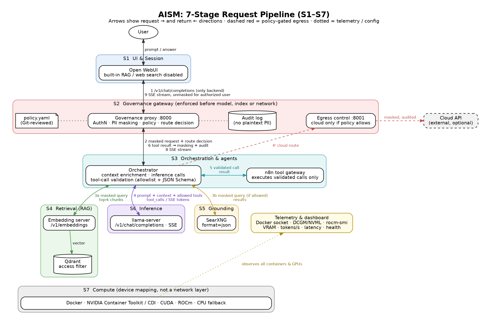
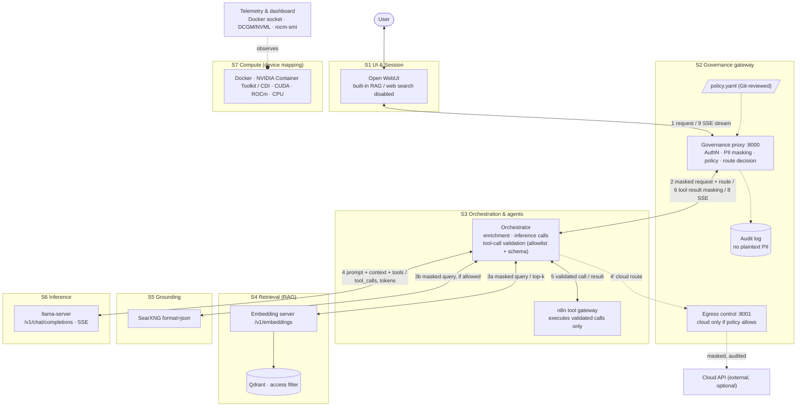

# AISM – AI Stack Reference Model

> **A testable reference model for governed local and hybrid AI stacks:** a specification with seven pipeline stages, a policy-as-code format, conformance levels K1–K3 with an automated test suite, and a reference implementation (the **AISM Reference Stack**) that shows the model can be built from established open-source components.

> **Independence:** AISM is an independent project. It is not affiliated with, endorsed by or derived from any other product or vendor named in this repository (see [Related projects](#11-related-projects)). Image tags, model choices and example domains in this document are illustrative and must be validated before production use.

**Documents (German):** [AISM specification](AISM-Spezifikation.md) · [Policy format](policy/AISM-Policy-Format.md) · [Conformance](conformance/AISM-Konformitaet.md) · [Positioning paper](positionierung/AISM-Positionierung.md)

**Status (2026-10-05):** the governance gateway ([`gateway/`](gateway/)) and the orchestrator ([`orchestrator/`](orchestrator/)) are **prototypes**. In the Docker conformance stack (capture mock instead of real models, test IdP, test signing key created at runtime) they pass all automated tests and reach **K3 Sovereign/Auditable**. Covered: signed policy with rejection of unsigned or tampered versions, images pinned by digest, cloud fallback with egress proof, OIDC via JWKS, masked web search and confirmation of write tools. This shows that the controls can be checked; it does **not** mean production readiness. Open WebUI, llama.cpp on GPU, n8n, SearXNG and a real IdP were not part of the run. Details: [`conformance/AISM-Konformitaet.md`](conformance/AISM-Konformitaet.md) §7.

---

## Table of Contents

1. [Why AISM](#1-why-aism)
2. [What AISM provides](#2-what-aism-provides)
3. [The 7-Stage Request Pipeline](#3-the-7-stage-request-pipeline)
4. [Interfaces Between the Stages](#4-interfaces-between-the-stages)
5. [Governance & Privacy](#5-governance--privacy)
6. [Verifiable Governance: Evidence and Conformance](#6-verifiable-governance-evidence-and-conformance)
7. [Running the AISM Reference Stack](#7-running-the-aism-reference-stack)
8. [Planned Tooling](#8-planned-tooling)
9. [Roadmap](#9-roadmap)
10. [Documentation](#10-documentation)
11. [Related projects](#11-related-projects)
12. [License & Contributing](#12-license--contributing)

---

## 1. Why AISM

Running language models on your own hardware is no longer the hard part. Model servers, chat front ends, vector databases, search engines and workflow tools are mature, and several projects package them so they are easy to deploy. What these projects usually do not answer is the question an organisation's data-protection officer, security team or auditor asks:

- Which component sees which data, and in which form?
- Where are personal data and secrets masked, and is that done **before** a model, an index or the network is reached?
- Who may use which model, document collection or tool, and who decided that?
- When may a request leave the organisation, and how is each case documented?
- How can a third party check that a **specific installation** behaves as claimed?

AISM treats these as engineering requirements. It describes an AI stack as a request pipeline with defined interfaces and enforcement points, writes the rules down as a signed, versioned policy file, and checks the result with tests that produce a machine-readable report.

## 2. What AISM provides

| Building block | Content | Where |
|---|---|---|
| **Reference model** | Seven stages S1–S7 in request order, interface contracts based on existing standards (OpenAI-compatible API, SSE, JSON Schema, JSON-RPC/MCP, W3C Trace Context), ten policy enforcement points PEP-1 … PEP-10, and MUST/SHOULD/MAY criteria | [`AISM-Spezifikation.md`](AISM-Spezifikation.md) |
| **Policy as code** | One declarative policy file covering identities and roles, PII detectors, data classes, local/cloud routing, tools, retrieval, web search and audit. It is validated against a JSON Schema, signed (SSHSIG/Ed25519) and carries a revision, and it is changed through review. | [`policy/`](policy/AISM-Policy-Format.md) |
| **Conformance levels** | **K1 Basic** (gateway enforced, API and streaming correct, no bypass), **K2 Governed** (masking, tool allowlist, audit without plaintext PII, cloud off by default), **K3 Sovereign/Auditable** (signed policy, pinned artefacts, trace IDs, tamper-evident audit, egress proof); a pytest suite produces a JSON report and badge | [`conformance/`](conformance/AISM-Konformitaet.md) |
| **Reference implementation** | The **AISM Reference Stack**: governance gateway and orchestrator prototypes, a Compose file that places established open-source components (Open WebUI, llama.cpp, Qdrant, SearXNG, n8n) in the pipeline, and a host firewall | [`gateway/`](gateway/), [`orchestrator/`](orchestrator/), [`docker-compose.yml`](docker-compose.yml), [`deploy/firewall/`](deploy/firewall/) |

Design principles:

- **Specification before product.** The reference stack is one implementation of the model. Any other stack can claim a conformance level by passing the same tests.
- **One control point.** Every request passes the governance gateway (S2) before it reaches orchestration, retrieval, models or the network.
- **Local by default, cloud only by rule.** Cloud models are disabled unless a policy rule allows them for a role and data class; every egress is audited with a hash of the masked payload.
- **Standard interfaces, swappable components.** Each stage can be replaced (for example vLLM for llama.cpp, Milvus for Qdrant, LibreChat for Open WebUI) as long as the interface contract and the tests still hold.

## 3. The 7-Stage Request Pipeline

The model is specified in [`AISM-Spezifikation.md`](AISM-Spezifikation.md) (German). Stages are numbered **S1–S7 top-down in request order**: a request enters at S1 and the hardware sits at S7. S4 and S5 are **parallel context providers** called by S3; their numbers imply no order between them.

| Stage | Name | Responsibility | Default | Alternatives | Component group (earlier numbering) |
|---|---|---|---|---|---|
| **S1** | UI & Session | User interaction, login, session, rendering the stream | Open WebUI | LibreChat, NextChat | L3 Interface & Chat |
| **S2** | Governance gateway | AuthN/AuthZ, PII masking, policy, routing (local vs. cloud), egress control, audit | AISM governance gateway (prototype) | PII Shield middleware; OPA for decisions | L7 Privacy & Governance |
| **S3** | Orchestration & agents | Context enrichment (calls S4 + S5 in parallel), inference calls, tool-call validation and execution | AISM orchestrator (prototype) + n8n as tool gateway | Flowise, LangGraph | L6 Workflows & Agents |
| **S4** | Retrieval (RAG) | Chunking, embeddings (separate endpoint), vector search | Embedding server + Qdrant | Milvus, Chroma; Unstructured for parsing | L4 Retrieval & Memory |
| **S5** | Grounding (web search) | Web search with the masked query | SearXNG (+ optional Perplexica) | any SearXNG-compatible frontend | L5 Search & Grounding |
| **S6** | Inference | Token generation over the OpenAI-compatible API, SSE streaming, tool-call proposals | llama.cpp (`llama-server`) | vLLM, Ollama; cloud API only via S2 | L2 Inference |
| **S7** | Compute | GPU/CPU/RAM for containers via device mapping (not a network layer) | Docker + NVIDIA Container Toolkit + CUDA | ROCm (AMD), Metal (Apple, native), CPU | L1 Compute & Hardware |
| cross-cutting | Telemetry & dashboard | Observes all stages; not in the request path | Docker socket, DCGM/NVML, `rocm-smi` | Prometheus/Grafana | — |

The last column keeps the bottom-up "layer" numbering of an earlier draft of this README so older references still resolve. The AISM specification (§4.3) uses the same mapping.

**Key rule:** S2 sits in front of everything. The UI talks **only** to the gateway, which masks PII and decides on policy **before** any request reaches a model, a vector index or the network.

### Architecture Diagram



Diagram sources: [`diagram.dot`](diagram.dot) (Graphviz, used to render the PNG) and [`diagram.mmd`](diagram.mmd) (Mermaid).



**Request flow in brief**

1. The user submits a prompt in the chat UI (S1).
2. The UI calls `/v1/chat/completions` on the governance gateway (S2). It is the UI's only backend.
3. S2 authenticates the user, masks PII, evaluates the policy (including the route: local, or cloud if policy allows), and writes an audit record.
4. The orchestrator (S3) enriches the masked request: in parallel it queries S4 (embedding, then Qdrant with access filter) and, if allowed, S5 (SearXNG). The context is injected into the prompt.
5. S3 calls **local inference** (S6) by default. A **cloud API** is reached only through S2's egress path, under policy.
6. If the model emits a tool call, S3 validates it against the allowlist and JSON Schema; only then does n8n execute it. The result is masked by S2, audited, and returned to the model as a `role: "tool"` message.
7. Tokens stream back via SSE: S6 → S3 → S2 (unmasking for authorized users, audit) → S1.
8. Telemetry observes every container and GPU throughout.

## 4. Interfaces Between the Stages

### 4.1 Inference-to-UI bridge

All model serving in the reference stack uses the **OpenAI-compatible API** (`POST /v1/chat/completions`, `GET /v1/models`, `POST /v1/embeddings`). `llama-server`, vLLM and Ollama all expose it, so the UI, the gateway, the orchestrator and the agent layer speak one protocol regardless of backend.

- Responses are streamed with **Server-Sent Events** (`"stream": true`), so tokens appear in the UI as they are generated.
- Open WebUI is configured as a generic OpenAI client whose **only** backend is the governance gateway (`OPENAI_API_BASE_URL=http://governance-proxy:8000/v1`), not an Ollama client and not the model server directly.
- Because the bridge is a plain HTTP API, the gateway (S2) and orchestrator (S3) can sit transparently between UI and model: they accept the same request shape, apply policy and enrichment, and relay the SSE stream.

### 4.2 RAG pipeline

Retrieval is a pipeline of distinct components run by the **orchestrator (S3)**, never by the UI. Open WebUI's built-in RAG and web search are disabled in the reference configuration, so every retrieval query has already passed PII masking in S2. Note that **Qdrant stores and searches vectors but does not create embeddings**; embeddings come from a separate model endpoint.

**Ingestion**

1. **Parse**: documents (PDF, DOCX, HTML, Markdown) are converted to text, optionally with Unstructured.
2. **Chunk**: the text is split into overlapping chunks sized for the embedding model's context.
3. **Embed**: each chunk is sent to a **dedicated embedding endpoint** (`POST /v1/embeddings`), for example:
   - a second `llama-server` instance started with `--embedding`, serving `nomic-embed-text` (GGUF), or
   - Hugging Face **Text Embeddings Inference (TEI)**.
4. **Store**: vectors are upserted into a **Qdrant** collection together with metadata (source, chunk ID, access tags).

**Query**

1. The **PII-masked** user query is embedded with **the same** embedding model.
2. Qdrant returns the top-k nearest chunks, **filtered** by the access groups the policy grants the user's roles.
3. Retrieved chunks are **injected into the prompt** as context, with source references, before S3 calls inference.

Web search (S5) runs in parallel to retrieval: S3 sends the masked query (placeholders stripped) to SearXNG's JSON API, if the policy allows web search for the request.

### 4.3 Agent tool routing

The reference stack treats every tool call as untrusted model output.

1. The model is given tool definitions and emits a **structured JSON tool call** (OpenAI `tool_calls` format: function name plus JSON arguments).
2. The **orchestrator (S3)** checks the call before anything runs:
   - **Allowlist check**: the tool must be permitted for this user's role and agent by the governance policy ([policy format](policy/AISM-Policy-Format.md), PEP-7).
   - **Schema validation**: the arguments are checked against the tool's JSON Schema (`additionalProperties: false`); malformed calls are rejected.
   - **Rate limits and data class**: per-tool limits and the request's data class must allow the call.
3. Only after all checks pass does **n8n** (or an MCP server) execute the workflow, using parameterized, preferably read-only operations. Write tools require user confirmation.
4. The tool result is passed through S2's PII masking, logged to the audit trail, and returned to the model as a `role: "tool"` message for the next turn.

This keeps execution authority outside the model: the model can only *propose* actions, and the governance gateway decides (via the policy enforced in S2 and S3).

### 4.4 Telemetry

The telemetry service collects operational signals from every stage:

| Signal | Source |
|---|---|
| Container state, restarts, CPU/RAM, logs | Docker Engine API via `/var/run/docker.sock` |
| NVIDIA GPU utilization, VRAM, temperature, power | NVML / NVIDIA **DCGM exporter** |
| AMD GPU utilization and VRAM | `rocm-smi` |
| Tokens/sec, time-to-first-token, request latency | Inference server metrics endpoints (e.g. `llama-server --metrics`, vLLM `/metrics`) and proxy timing |
| Service health | `/health` endpoints and container healthchecks |

Metrics are exposed in Prometheus format for an existing Prometheus/Grafana setup. Telemetry never contains prompt content (S-08).

## 5. Governance & Privacy

The governance gateway (S2) is a **reverse-proxy middleware** that sits between every client (chat UI, agents, workflows) and everything behind it: orchestration, retrieval, models and the network. It terminates its own TLS and does no TLS interception. Its behaviour is defined declaratively in a versioned policy file ([`policy/AISM-Policy-Format.md`](policy/AISM-Policy-Format.md), schema [`policy/policy.schema.json`](policy/policy.schema.json), example [`policy/policy.example.yaml`](policy/policy.example.yaml)), changed only via Git review.

### Capabilities

- **PII masking**: before a prompt reaches any model, detectors replace sensitive entities with reversible placeholders, for example:
  - personal **names** → `<PERSON_1>`
  - **email addresses** → `<EMAIL_1>`
  - **API keys / secrets / tokens** → `<SECRET_1>`

  Placeholders can be restored in the response for the authorized user; the model only sees masked text.
- **Policy engine**: per-user, per-role and per-workspace rules that decide which models, data collections and tools a request may use.
- **Tool access control**: the allowlist S3 enforces before n8n executes any tool call (§4.3).
- **Audit logging**: every request, routing decision, tool call and policy outcome is recorded with a timestamp, identity and decision, so it can be reviewed later.

### Hybrid routing and data egress

The reference stack is **local-first, not local-only**. By default, inference runs on local hardware. When a policy allows it (for example, for a task class that needs a larger model), the router may forward a request to a **cloud API**.

Data leaves the deployment **only through the governance gateway (S2) and only under policy**:

- The request has already been PII-masked.
- The policy must explicitly permit cloud routing for that user, workspace and data class.
- The egress event is written to the audit log.
- Operators can disable cloud routing entirely, in which case no prompt data is sent to external model providers.

Network segmentation backs this up in the reference compose: inference, embeddings, Qdrant and the orchestrator sit on an internal `backend` network with no internet access and no published ports; only the gateway and SearXNG are attached to the `egress` network.

Note that some components can make outbound network calls by design, notably web search (SearXNG) and any tools that call external APIs. These are governed by the same policy and logging model, and can be disabled for air-gapped deployments.

## 6. Verifiable Governance: Evidence and Conformance

AISM is meant to be checked, not believed. The reference stack produces evidence that an auditor can examine without trusting the operator's description:

| Evidence | How it is produced | Criterion / test |
|---|---|---|
| Which rules were in force | every audit entry carries policy name, version, revision and SHA-256 digest; the policy file is signed and the gateway reports `signature.verified` | M-15, S-11 · AISM-K2-09, -K3-01, -K3-09 |
| That a tampered or unsigned policy is not used | fault injection: the suite swaps in unsigned and modified files, the gateway keeps the previous policy and logs `policy.load_failed` | S-11 · AISM-K3-08 |
| That the log was not edited afterwards | hash chain (`prev_hash` = SHA-256 of the previous line), continued across restarts | S-02 · AISM-K3-07 |
| What left the organisation | `egress.cloud` with rule ID, provider, policy digest and SHA-256 of the masked payload; web searches as `egress.websearch` with a query hash | S-13 · AISM-K3-04, -K3-10, -K2-19 |
| That no plaintext PII reached models or logs | capture mock records what S3–S6 receive; the audit log is searched for the synthetic test values | M-02, M-05 · AISM-K2-03, -K2-08 |
| Which software ran | images pinned by `@sha256` digest; locally built images are reproducible (identical digests in two clean builds) | S-07 · AISM-K3-05 |
| One request across all stages | W3C `traceparent` propagated; trace ID in every audit entry | S-10 · AISM-K3-02, -K3-03 |

The conformance levels are a **technical self-test** against the specification. They are not a certification and do not establish legal compliance. How well names and other free-text PII are detected is measured separately, on synthetic German data, in [`conformance/pii-eval/`](conformance/pii-eval/README.md). On the fresh held-out set the default detector (German name gazetteer plus `xx_ent_wiki_sm`) leaves about 30 % of person names unmasked. The older held-out set, which the first measurement reported at 14 % unmasked, is easier; the same default reaches about 6 % unmasked there. Both sets are synthetic.

GitHub Actions (`.github/workflows/ci.yml`) runs the same steps as [`tools/ci-local.sh`](tools/ci-local.sh): Ruff, gateway and orchestrator unit tests, JSON Schema validation of `policy/policy.example.yaml`, an Ed25519 signature round trip with a key generated at runtime, the PII recall gate, a two-build digest comparison, and the conformance suite on the Docker stack. The cloud-fallback scenario runs first, then the full suite. The report and the shields.io badge are uploaded as artifacts. That job uses the capture mock. It does not start Open WebUI, llama.cpp, n8n or SearXNG.

## 7. Running the AISM Reference Stack

The reference stack for a single NVIDIA GPU host is maintained as [`docker-compose.yml`](docker-compose.yml) in this repository; it is reproduced below. Secrets come from a `.env` file (template: [`.env.example`](.env.example)), and the gateway mounts the policy file:

```bash
cp policy/policy.example.yaml policy/policy.yaml   # then adapt roles, providers, tools
cp .env.example .env                               # then set random secrets (chmod 600 .env)
# sign the policy (the gateway refuses unsigned policies by default, see "Policy signing" below)
python3 tools/aism-policy-sign.py keygen --out ~/.aism-signing --identity you@example.org   # private key stays outside the repo
cp ~/.aism-signing/allowed_signers config/policy-trust/allowed_signers                       # public trust anchor only
python3 tools/aism-policy-sign.py sign --key ~/.aism-signing/policy-signing.key --identity you@example.org policy/policy.yaml
python3 tools/aism-policy-sign.py verify --allowed-signers config/policy-trust/allowed_signers policy/policy.yaml
sudo deploy/firewall/docker-user.sh apply          # recommended: no internet egress from `frontend`
docker compose config -q && docker compose up -d --build
```

> **Images are pinned by tag and `@sha256` digest** (multi-arch index digests resolved on 2026-10-05 with [`tools/resolve_digests.py`](tools/resolve_digests.py) against the registry API and cross-checked with `docker buildx imagetools inspect`). The tags are examples of tested versions, not recommendations; re-resolve the digests when you update a tag. `governance-proxy` and `orchestrator` are **built locally** from the prototypes in [`gateway/`](gateway/) and [`orchestrator/`](orchestrator/) (build context: repository root); they are not production-ready. See "Reproducible builds" below.

### Policy signing

The gateway only activates a policy whose detached signature verifies. A single file `policy.yaml.sig` is checked against `config/policy-trust/allowed_signers` (env `POLICY_ALLOWED_SIGNERS`). For K3, a bundle `policy.yaml.sigs` is checked against a quorum keyring `config/policy-trust/keyring.yaml` (two distinct valid signers by default; one key cannot rotate the ring). An unsigned, tampered, under-threshold or older (`effectiveFrom`) policy is rejected, the previous policy stays active, and the audit log records `policy.load_failed` plus the signer identities. The format is OpenSSH **SSHSIG with Ed25519** (namespace `aism-policy`). It works offline, needs no infrastructure, and anyone can verify each signature independently:

```bash
ssh-keygen -Y verify -f config/policy-trust/allowed_signers -I you@example.org -n aism-policy \
  -s policy/policy.yaml.sig < policy/policy.yaml
```

`tools/aism-policy-sign.py sign` sets `metadata.revision` (Git commit, or a content hash outside Git) and `metadata.signature`, then writes the signature. With `--keyring` it appends to `policy.yaml.sigs` without rewriting the policy, so the second signer does not invalidate the first. The policy volume is mounted as a directory (`./policy:/etc/aism/policy:ro`), so the policy and its signatures are always replaced together. Keep private keys off the server and out of the repository. The quick start above is the one-signature anchor (threshold 1). K3 uses `init-keyring` / `rotate-key` / `revoke-key`; details and the threat-model limits (no HSM, no transparency log) are in [`policy/AISM-Policy-Format.md`](policy/AISM-Policy-Format.md) §6.1–§6.2 and [`config/policy-trust/README.md`](config/policy-trust/README.md).

### Reproducible builds of the local images

`governance-proxy` and `orchestrator` are built from a digest-pinned base image (`python:3.12-slim@sha256:…`). All Python dependencies, including transitive ones, are installed from `requirements.lock` with hashes (`pip install --require-hashes --no-deps`, generated with `pip-compile --generate-hashes`). The images contain no `.pyc` files (`--no-compile`) and are built without `useradd`, which would write a date into `/etc/shadow`. On 2026-10-05, building each image twice with `--no-cache` gave **bit-identical OCI images**: same manifest digest, gateway `sha256:43723f7e…8c4c`, orchestrator `sha256:c6a8d9b7…bb3bb`. Build settings: BuildKit `docker-container` builder, `SOURCE_DATE_EPOCH=1791158400`, `rewrite-timestamp=true`, provenance and SBOM off. With the previous Dockerfile (unpinned transitive deps, compiled `.pyc` files) the two builds differed in one layer.

```bash
docker buildx create --name aism-repro --driver docker-container
tools/repro_build.sh gateway        # builds twice, prints both digests, exits 1 if they differ
```

These digests apply only to this exact source tree, and they were checked only on one host and builder. For a release, push the image to your registry (`--output type=registry` with the same settings). Then reference it in a compose override as `image: ghcr.io/marksen23/aism-gateway:0.1.0@sha256:<pushed digest>` without `build:`. Anyone can rebuild it from the tagged source and compare the digest. The lock files must be regenerated when `requirements.txt` changes.

```yaml
# AISM Reference Stack (NVIDIA GPU host), aligned with AISM-Spezifikation.md (S1–S7)
# - No top-level `version:` key (obsolete in Compose v2+).
# - Images are pinned by tag AND @sha256 digest (multi-arch index digest, resolved 2026-10-05 via the
#   registry API: tools/resolve_digests.py; cross-checked with `docker buildx imagetools inspect`).
#   The tags are examples of tested versions, not recommendations; re-resolve when updating.
# - Before first start: cp policy/policy.example.yaml policy/policy.yaml && edit; create .env with the secrets below.

name: aism

# Fixed bridge names so the host firewall can match them (deploy/firewall/).
networks:
  frontend:            # S1 <-> S2: UI and admin access (published ports live here)
    driver_opts:       # outbound internet from this bridge is dropped by deploy/firewall/
      com.docker.network.bridge.name: aism-frontend
  backend:
    internal: true     # S2–S6: no direct internet access, no published ports
    driver_opts:
      com.docker.network.bridge.name: aism-backend
  egress:              # only S2 (cloud fallback) and S5 (web search) may reach the internet
    driver_opts:
      com.docker.network.bridge.name: aism-egress

volumes:
  open-webui:
  qdrant:
  n8n:
  audit:

services:

  # ── S1 UI & Session (README component group: Interface & Chat) ──
  open-webui:
    # v0.11.4: all variables below verified in backend/open_webui/{config,env}.py at this tag.
    # The JWT forwarding variables (FORWARD_USER_INFO_HEADER_JWT_SECRET) do not exist in v0.6.30;
    # they first appear in v0.9.6.
    image: ghcr.io/open-webui/open-webui:v0.11.4@sha256:9591b13f13843c7721c2b8eaf7382846c81b3ffe126526d1888d1fed50c6a33f
    restart: unless-stopped
    networks: [frontend]
    ports:
      - "3000:8080"
    environment:
      # Only backend: the governance gateway (S2). No direct model access.
      OPENAI_API_BASE_URL: http://governance-proxy:8000/v1
      OPENAI_API_KEY: ${AISM_UI_CLIENT_KEY:?set AISM_UI_CLIENT_KEY in .env}
      ENABLE_OLLAMA_API: "false"
      ENABLE_DIRECT_CONNECTIONS: "false"        # users cannot add their own model endpoints
      # Built-in RAG / web search off: retrieval and search run in S3 after masking
      ENABLE_WEB_SEARCH: "false"
      USER_PERMISSIONS_FEATURES_WEB_SEARCH: "false"
      ENABLE_SEARCH_QUERY_GENERATION: "false"
      ENABLE_RETRIEVAL_QUERY_GENERATION: "false"
      USER_PERMISSIONS_CHAT_FILE_UPLOAD: "false"
      BYPASS_EMBEDDING_AND_RETRIEVAL: "true"
      # Environment values win over settings persisted in the Open WebUI database
      ENABLE_PERSISTENT_CONFIG: "false"
      # No model downloads from the internet (the frontend network has no egress, deploy/firewall/)
      OFFLINE_MODE: "true"
      # Forward user identity to S2 as one signed HS256 JWT (header X-OpenWebUI-User-Jwt) instead
      # of plaintext X-OpenWebUI-User-* headers. Claims: sub, email, name, role, iss, iat, exp –
      # no groups (see AISM-Spezifikation.md §10).
      ENABLE_FORWARD_USER_INFO_HEADERS: "true"
      FORWARD_USER_INFO_HEADER_JWT_SECRET: ${AISM_FORWARD_JWT_SECRET:?set AISM_FORWARD_JWT_SECRET in .env}
    volumes:
      - open-webui:/app/backend/data
    depends_on:
      - governance-proxy

  # ── S2 Governance gateway (README: Privacy & Governance) ─────────
  governance-proxy:
    build:                       # prototype in ./gateway (see gateway/README.md)
      context: .
      dockerfile: gateway/Dockerfile
    image: ghcr.io/marksen23/aism-gateway:0.1.0-dev   # local build tag; base image pinned by digest in the Dockerfile.
                                            # Release: push and pin by digest, see README "Reproduzierbare Builds"
    restart: unless-stopped
    networks:
      frontend: {}
      backend: {}
      egress:
        gw_priority: 1           # default route via the egress bridge (frontend egress is dropped)
    ports:
      - "127.0.0.1:8000:8000"     # OpenAI-compatible API for local API clients / conformance tests
    environment:
      POLICY_PATH: /etc/aism/policy/policy.yaml
      # K3-01/K3-08/K3-11: refuse unsigned policies. keyring.yaml next to allowed_signers, when present,
      # is the quorum trust anchor (threshold, validity, revocation); otherwise the single-sig file is.
      POLICY_REQUIRE_SIGNATURE: ${AISM_POLICY_REQUIRE_SIGNATURE:-true}
      POLICY_ALLOWED_SIGNERS: /etc/aism/trust/allowed_signers
      LISTEN_PUBLIC: 0.0.0.0:8000         # /v1/*, /health, /aism/v1/policy
      LISTEN_INTERNAL: 0.0.0.0:8001       # /internal/* for S3 only (mask, egress); token-protected
      UPSTREAM_ORCHESTRATOR: http://orchestrator:9000/v1
      INTERNAL_TOKEN: ${AISM_INTERNAL_TOKEN:?set AISM_INTERNAL_TOKEN in .env}
      AISM_FORWARD_JWT_SECRET: ${AISM_FORWARD_JWT_SECRET}
      AISM_UI_CLIENT_KEY: ${AISM_UI_CLIENT_KEY}
      AISM_CLOUD_API_KEY: ${AISM_CLOUD_API_KEY:-}   # only used if policy routing.cloudEnabled=true
      AUDIT_LOG_PATH: /audit/audit.jsonl
      OTEL_EXPORTER_OTLP_ENDPOINT: ${OTEL_EXPORTER_OTLP_ENDPOINT:-}
    volumes:
      # directory mount (not a single-file mount): atomic replacements of policy.yaml / policy.yaml.sig / policy.yaml.sigs
      # are visible to the hot reload
      - ./policy:/etc/aism/policy:ro
      - ./config/policy-trust:/etc/aism/trust:ro   # trust anchor, separate from the policy repo
      - audit:/audit
    depends_on:
      - orchestrator

  # ── S3 Orchestration & agents (README: Workflows & Agents) ───────
  orchestrator:
    build:                       # minimal stub in ./orchestrator (see orchestrator/README.md)
      context: .
      dockerfile: orchestrator/Dockerfile
    image: ghcr.io/marksen23/aism-orchestrator:0.1.0-dev   # local build tag
    restart: unless-stopped
    networks: [backend]
    environment:
      POLICY_PATH: /etc/aism/policy/policy.yaml   # S3 uses only the policy digest announced by S2 (verified there)
      INFERENCE_LOCAL_URL: http://llama-server:8080/v1
      EMBEDDINGS_URL: http://llama-embed:8080/v1
      QDRANT_URL: http://qdrant:6333
      QDRANT_API_KEY: ${AISM_QDRANT_API_KEY:?set AISM_QDRANT_API_KEY in .env}
      SEARXNG_URL: http://searxng:8080
      TOOL_GATEWAY_URL: http://n8n:5678
      N8N_WEBHOOK_TOKEN: ${AISM_N8N_WEBHOOK_TOKEN:?set AISM_N8N_WEBHOOK_TOKEN in .env}
      GATEWAY_INTERNAL_URL: http://governance-proxy:8001
      INTERNAL_TOKEN: ${AISM_INTERNAL_TOKEN}
    volumes:
      - ./policy:/etc/aism/policy:ro
    depends_on:
      llama-server:
        condition: service_healthy
      llama-embed:
        condition: service_healthy
      qdrant:
        condition: service_started

  # ── S6 Inference: chat model (README: Inference) ─────────────────
  llama-server:
    image: ghcr.io/ggml-org/llama.cpp:server-cuda-b11382@sha256:ef08b5a98b1170f2b62177be0a4027c88a84043c55afbf190dd18b9e7cdcfebf   # build b11382 (= server-cuda on 2026-10-05)
    restart: unless-stopped
    networks: [backend]            # internal only, no published ports
    volumes:
      - ./models:/models:ro
    command: >
      -m /models/qwen2.5-7b-instruct-q4_k_m.gguf
      --host 0.0.0.0 --port 8080
      -ngl 99
      -c 8192
      --jinja
      --metrics
    deploy:
      resources:
        reservations:
          devices:
            - driver: nvidia
              count: all
              capabilities: [gpu]
    healthcheck:
      test: ["CMD", "curl", "-fsS", "http://localhost:8080/health"]
      interval: 30s
      timeout: 5s
      retries: 5
      start_period: 120s

  # ── S4 Retrieval: embedding endpoint (separate from Qdrant) ──────
  llama-embed:
    image: ghcr.io/ggml-org/llama.cpp:server-cuda-b11382@sha256:ef08b5a98b1170f2b62177be0a4027c88a84043c55afbf190dd18b9e7cdcfebf
    restart: unless-stopped
    networks: [backend]
    volumes:
      - ./models:/models:ro
    command: >
      -m /models/nomic-embed-text-v1.5.Q8_0.gguf
      --host 0.0.0.0 --port 8080
      --embedding
      -ngl 99
    deploy:
      resources:
        reservations:
          devices:
            - driver: nvidia
              count: all
              capabilities: [gpu]
    healthcheck:
      test: ["CMD", "curl", "-fsS", "http://localhost:8080/health"]
      interval: 30s
      timeout: 5s
      retries: 5
      start_period: 60s

  # ── S4 Retrieval: vector store ───────────────────────────────────
  qdrant:
    image: qdrant/qdrant:v1.15.4@sha256:6ac4807063bbecddca0250bfbcff52acf18c22263b904d12919349e6d0a408f1
    restart: unless-stopped
    networks: [backend]
    environment:
      QDRANT__SERVICE__API_KEY: ${AISM_QDRANT_API_KEY}
    volumes:
      - qdrant:/qdrant/storage

  # ── S3 Tool gateway ──────────────────────────────────────────────
  n8n:
    image: n8nio/n8n:1.110.1@sha256:6c0c7650150a3fb0fd30d13160a87b5227963c36c9297b5bda618bcadfcee932
    restart: unless-stopped
    # frontend only for the editor UI (bound to localhost). Note: `frontend` is not an
    # internal network (needed for published ports), so restrict container egress on the
    # host firewall (DOCKER-USER chain) unless policy allows external tool targets.
    networks: [backend, frontend]
    ports:
      - "127.0.0.1:5678:5678"
    environment:
      N8N_HOST: localhost
      N8N_PORT: "5678"
      GENERIC_TIMEZONE: Europe/Berlin
    volumes:
      - n8n:/home/node/.n8n

  # ── S5 Grounding: web search (egress under policy) ───────────────
  searxng:
    image: searxng/searxng:2026.10.4-d48c4b555@sha256:76b0bf285aca014c7191fc4d9234c4bfb358624ac33d8883833d496c059ec072   # (previous tag 2025.9.20-5cbd2b6 did not exist)
    restart: unless-stopped
    networks:
      backend: {}
      egress:
        gw_priority: 1
    volumes:
      - ./config/searxng:/etc/searxng   # settings.yml must enable the `json` output format
    environment:
      SEARXNG_BASE_URL: http://searxng:8080/
      SEARXNG_SECRET: ${AISM_SEARXNG_SECRET:?set AISM_SEARXNG_SECRET in .env}

  # Optional: Perplexica as an additional search UI. Its LLM provider MUST point at
  # http://governance-proxy:8000/v1. Enable with: docker compose --profile perplexica up -d
  perplexica:
    image: itzcrazykns1337/perplexica:v1.11.0@sha256:9f371a89e6d9b34e3431f2418d4aad472f96db03d647926cb572380e6ebe09cd
    profiles: [perplexica]
    restart: unless-stopped
    networks: [frontend, backend]
    ports:
      - "3001:3000"
    environment:
      SEARXNG_API_URL: http://searxng:8080
    volumes:
      - ./config/perplexica:/home/perplexica/config
    depends_on:
      - searxng
      - governance-proxy
```

**Notes**

- **Gateway-only UI:** Open WebUI's only model backend is `governance-proxy` (`OPENAI_API_BASE_URL=http://governance-proxy:8000/v1`); Ollama API and user-defined direct connections are disabled.
- **No RAG / web search in the UI:** `ENABLE_WEB_SEARCH`, `USER_PERMISSIONS_FEATURES_WEB_SEARCH`, `USER_PERMISSIONS_CHAT_FILE_UPLOAD`, `BYPASS_EMBEDDING_AND_RETRIEVAL` and the query-generation flags make sure retrieval and search happen in the orchestrator (S3) after masking. `ENABLE_PERSISTENT_CONFIG=false` keeps admin-UI changes from overriding these values, and `OFFLINE_MODE=true` stops model downloads (the frontend network has no internet egress).
- **Open WebUI pin `v0.11.4`:** every Open WebUI variable in the compose file was checked against `backend/open_webui/config.py` and `env.py` at tag `v0.11.4` (2026-10-05). The previously pinned `v0.6.30` lacks `FORWARD_USER_INFO_HEADER_JWT_SECRET`/`FORWARD_USER_INFO_HEADER_JWT`; they first appear in `v0.9.6`.
- **Identity:** Open WebUI sends its client key (`OPENAI_API_KEY`) and forwards the user as one signed HS256 JWT in `X-OpenWebUI-User-Jwt` instead of plaintext `X-OpenWebUI-User-*` headers (`ENABLE_FORWARD_USER_INFO_HEADERS` + `FORWARD_USER_INFO_HEADER_JWT_SECRET`). The gateway validates both (policy `subjects.identitySources`). The JWT carries `sub`, `email`, `name`, `role`, `iss`, `iat`, `exp` – **no groups**. The example policy therefore maps Open WebUI users to `staff` via the `role` claim. Group-based roles such as `it-ops` need an OIDC access token: the gateway validates `oidc-bearer` sources against the IdP JWKS (asymmetric algorithms only, `iss`/`aud`/`exp`/`sub` required) and maps the `groups` claim to policy roles. If the JWKS cannot be fetched, the gateway fails closed with 503. This was tested against a local test IdP only. The gateway never writes `email` or `name` to the audit log.
- **Network split:**
  - `frontend`: UI, gateway, n8n editor (localhost only), optional Perplexica.
  - `backend` (`internal: true`): orchestrator, `llama-server`, embeddings, Qdrant, n8n, SearXNG. No internet, no published ports.
  - `egress`: only the gateway (cloud fallback under policy) and SearXNG (web search).
  - Docker can only publish ports from non-internal networks, so `frontend` would have outbound internet access. The reference host firewall in [`deploy/firewall/`](deploy/firewall/) (iptables `DOCKER-USER` or nftables) drops every new connection leaving the `aism-frontend` bridge; only the `egress` network may reach the internet. The bridges get fixed names (`com.docker.network.bridge.name`) for this, and the gateway and SearXNG prefer the egress network as default route (`gw_priority: 1`, Docker Engine ≥ 28).
- **Inference not exposed:** `llama-server` and `llama-embed` have no `ports:` mapping and are reachable only from the `backend` network.
- **GPU:** `-ngl 99` offloads all layers to the GPU; the installer lowers it (or uses a CPU image) when VRAM is insufficient. On AMD hosts it switches to a ROCm build and maps `/dev/kfd` and `/dev/dri`.
- **Perplexica** is optional (`--profile perplexica`); its own LLM provider must point at the gateway.

## 8. Planned Tooling

None of the following exists yet; it is listed so that contributors know the intended direction.

- **Installer script.** A script that checks the host (RAM, disk, GPU vendor and VRAM), installs Docker and the GPU container runtime, chooses a quantized model that fits, generates `.env` and a signing key pair, and starts the stack. On hosts without a supported GPU it would fall back to a CPU build and a smaller model; on Apple Silicon inference would run natively outside containers. Planned distribution URL: `https://install.aism.example/install.sh`. This is a **placeholder** under the reserved `.example` domain (RFC 2606) and does not resolve. Review any install script before running it.
- **`aism` command-line tool.** It would wrap the existing scripts: `aism policy sign|verify|explain`, `aism conformance run`, `aism doctor` (configuration and firewall checks), `aism up|down|status`.
- **Governance view.** A read-only web view of audit entries, policy decisions, refused tool calls, pending confirmations and egress events, on top of the hash-chained audit log. Service and GPU metrics are left to standard Prometheus/Grafana. Any component with access to `/var/run/docker.sock` is root-equivalent on the host: it must bind to localhost or sit behind authentication (M-14), preferably through a read-restricted socket proxy.

## 9. Roadmap

- **Governance gateway** (prototype in [`gateway/`](gateway/)): test with a real IdP (Keycloak/Entra ID); name detection on real text (default held-out v2 masked recall 0.703; an optional cascade reaches 0.969 on v2 and 1.000 on frozen v3, GLiNER-only reaches 1.00, [`conformance/pii-eval/`](conformance/pii-eval/README.md)); OpenTelemetry export, hardening and load tests. Signing-key rotation and four-eyes policy signatures are in the keyring (§6.2 of the policy format); an HSM and a transparency log are not.
- **Orchestrator** (prototype in [`orchestrator/`](orchestrator/)): persistent store for pending confirmations and a UI for them; per-query web-search policy evaluation; RAG ingest; MCP execution.
- **Conformance suite**: CI now runs it against the mock stack. Still open: the real components (Open WebUI, llama.cpp on GPU, n8n, SearXNG), the remaining manual checks (K2-14, K3-06 model checksums), and a public test report format for third-party implementations.
- **Specification**: public comment period towards AISM 1.0; mapping of the criteria to common control catalogues.
- **Reference configurations**: AMD/ROCm and Apple Silicon; Compose profiles for smaller setups (no RAG, no agents); example n8n workflows for read-only tool calls.

## 10. Documentation

| Document | Language | Content |
|---|---|---|
| [`AISM-Spezifikation.md`](AISM-Spezifikation.md) / [PDF](AISM-Spezifikation.pdf) | German | AISM reference model: stages S1–S7, interfaces, request flow, policy control points, MUST/SHOULD criteria |
| [`policy/AISM-Policy-Format.md`](policy/AISM-Policy-Format.md) / [PDF](policy/AISM-Policy-Format.pdf) | German | Policy-as-code format for the gateway; [`policy.schema.json`](policy/policy.schema.json), [`policy.example.yaml`](policy/policy.example.yaml) |
| [`conformance/AISM-Konformitaet.md`](conformance/AISM-Konformitaet.md) / [PDF](conformance/AISM-Konformitaet.pdf) | German | Conformance levels K1 Basic, K2 Governed, K3 Sovereign/Auditable; test catalog, report format, current results; pytest suite in [`conformance/tests`](conformance/tests) |
| [`positionierung/AISM-Positionierung.md`](positionierung/AISM-Positionierung.md) / [PDF](positionierung/AISM-Positionierung.pdf) | German | Positioning paper: AISM as a reference model, conformance levels, roadmap |
| [`gateway/README.md`](gateway/README.md) | English | Governance gateway prototype (S2): features, configuration, limitations |
| [`orchestrator/README.md`](orchestrator/README.md) | English | Orchestrator prototype (S3): tool loop, confirmation flow, web search |
| [`deploy/firewall/README.md`](deploy/firewall/README.md) | English | Reference host firewall: no internet egress from the frontend network; results on a real Docker host incl. IPv6 |
| [`conformance/pii-eval/README.md`](conformance/pii-eval/README.md) | German | Synthetic German PII evaluation and measured detection rates (regex, gazetteer, spaCy, optional GLiNER, optional cascade) |
| [`config/policy-trust/README.md`](config/policy-trust/README.md) | English | Trust anchor (`allowed_signers`) for policy signatures |
| [`tools/`](tools/) | English | `ci-local.sh` (same steps as CI), `aism-policy-sign.py` (keygen/sign/verify), `validate_policy.py` (JSON Schema), `build_name_gazetteer.py` (rebuild the German name lists), `resolve_digests.py` (registry digests), `repro_build.sh` (reproducible build check), `build_spec_pdf.py` (Markdown → PDF for the spec, policy format and conformance documents) |
| [`diagram.png`](diagram.png) | English | Architecture and request flow ([`diagram.dot`](diagram.dot), [`diagram.mmd`](diagram.mmd)) |

## 11. Related projects

Other open-source projects also combine local model serving, chat, retrieval and automation; some focus on easy installation, others on single applications. Examples, without any claim of completeness or ranking: **Harbor** (a CLI and Compose setup for local LLM tools), the **n8n Self-hosted AI Starter Kit** (n8n, Ollama and Qdrant in Docker Compose), **LocalAI** (an OpenAI-compatible local inference server), **AnythingLLM** (an all-in-one application for chatting with documents), and **Osmantic ODS** (Osmantic Deployment System, an open-source deployment system for local and hybrid AI services).

AISM is **independent** of all of them. It has no affiliation, partnership or endorsement and shares no code or texts with them. AISM is not a deployment tool. It is a reference model with a test suite, and any of these stacks could in principle be checked against the conformance levels. Product names belong to their respective owners.

## 12. License & Contributing

AISM (specification, policy format, conformance suite and the AISM Reference Stack) is licensed under the **Apache License 2.0**. See [`LICENSE`](LICENSE) for the full text and [`NOTICE`](NOTICE) (copyright: AISM contributors).

Each bundled component keeps its own license; check the upstream projects before redistributing images.

**Contributing**

Contributions are welcome:

1. Open an issue to discuss significant changes before submitting a pull request.
2. Fork the repository, create a feature branch and keep changes focused.
3. Include documentation and, where applicable, tests or a reproducible Compose example.
4. Be respectful in all project spaces (a Code of Conduct file is still to be added).

Good first areas: conformance tests for further criteria, PII detectors and evaluation data, alternative stage integrations (vLLM, Milvus, LibreChat), and mappings of the policy format to OPA/Rego.
